OpenMediaVault(OMV)は、DebianをベースにしたオープンソースのNASソフトウェアで、ユーザーが簡単にNASを構築できるように設計されています。

今回は、OpenMediaVaultを使用して、Windowsからアクセスできるファイルサーバーを構築します。

## はじめに

サーバーのハードウェアには、GMKtecのNucBox M5 Plusを選択しました。

ミニPCには仮想化プラットフォームのProxmox VEをインストールしているため、そこに仮想マシンを作成してOpenMediaVaultをインストールします。

## OpenMediaVaultのインストール

OpenMediaVaultのISOイメージをダウンロードし、サーバーにインストールします。以下の記事を参考にOpenMediaVaultをインストールしましょう。

[OpenMediaVaultをインストールする](/blog/install-openmediavault)

管理画面の言語変更、管理者ユーザー(`admin`)のパスワード変更も忘れずに実施しておきましょう。

Proxmox VE上の仮想マシンにインストールする場合は、「[Proxmox VEで仮想マシン(VM)を作成する](/blog/create-vm-in-proxmox-ve)」の記事も参考にしてください。

## 静的IPアドレスの割り当て

デフォルトではDHCPが有効になっています。NASのIPアドレスが変化しないように、静的IPアドレスを割り当てます。

メニューから「ネットワーク > インタフェース」を選択し、ネットワークの設定画面を開きましょう。

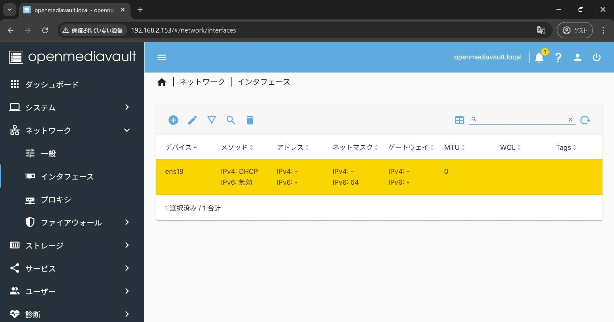

設定を変更するデバイスを選択後、ペンのアイコンをクリックして編集画面を開きます。

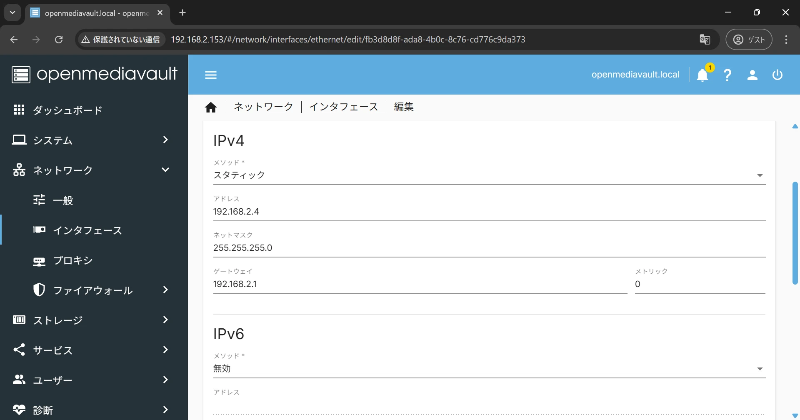

IPv4にて、静的IPアドレスが割り当てられるよう設定を変更します。高度な設定にて、DNSサーバーのアドレスも入力し、保存しましょう。

IPアドレスを変更するとサーバーとの接続が切れるため、変更後のIPアドレスで再度管理画面に接続しましょう。

## ディスクの初期化

OpenMediaVaultに接続したディスクの初期化を行います。既にファイルシステム作成済みのディスクをマウントする場合はスキップしましょう。

メニューから「ストレージ > ディスク」を選択し、ディスクの設定画面を開きましょう。

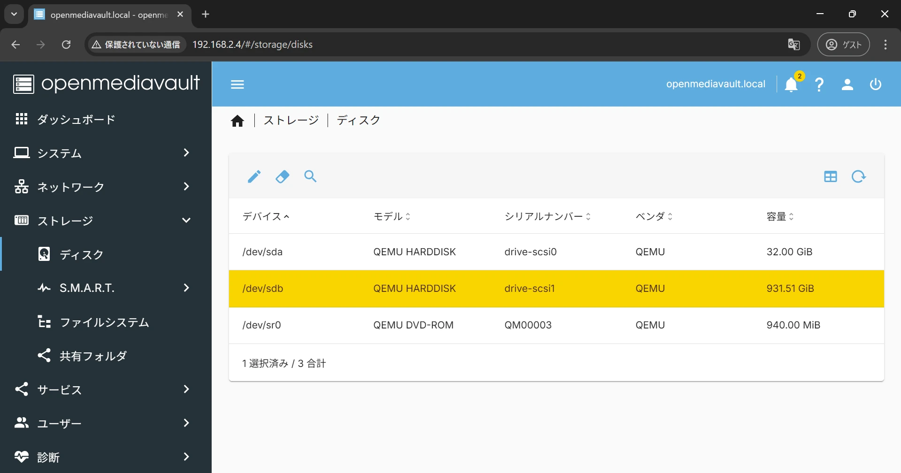

設定を変更するデバイスを選択後、消しゴムのアイコンをクリックしてディスクの消去画面を開きます。

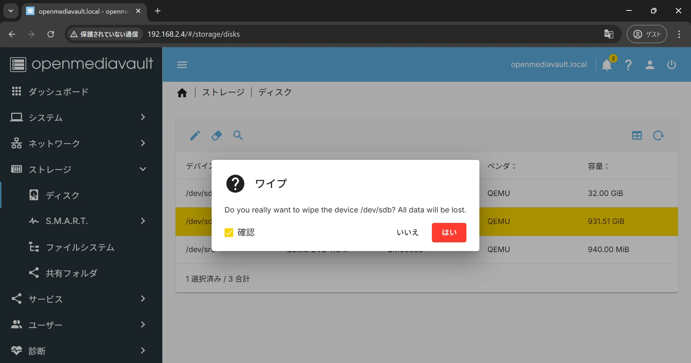

クイックかセキュアか消去方法が選択できますが、特に指定がなければクイックで問題ありません。

クイックの場合はファイルシステムが消去され、セキュアの場合は全て消去されます。

## ファイルシステムの作成

OpenMediaVaultに接続したディスクにファイルシステムを作成します。既にファイルシステム作成済みのディスクをマウントする場合はスキップしましょう。

メニューから「ストレージ > ファイルシステム」を選択し、ファイルシステムの設定画面を開きましょう。

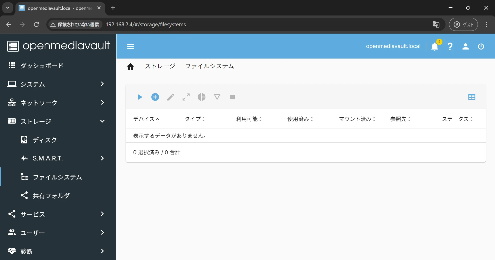

プラスアイコンをクリックし、作成したいファイルシステムを選択してファイルシステムの作成画面を開きます。今回はExt4を選択しました。

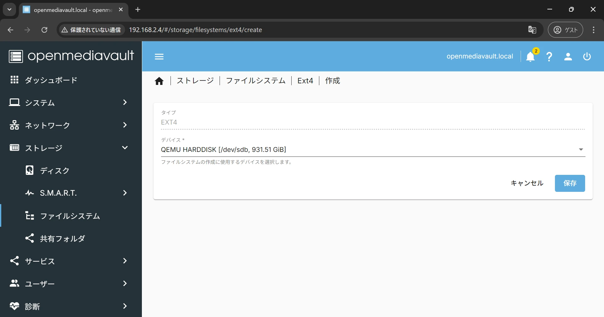

ファイルシステムを作成したいディスクを選択し、ファイルシステムを作成しましょう。

## 共有フォルダの作成

共有フォルダを作成します。メニューから「ストレージ > 共有フォルダ」を選択し、共有フォルダの設定画面を開きましょう。

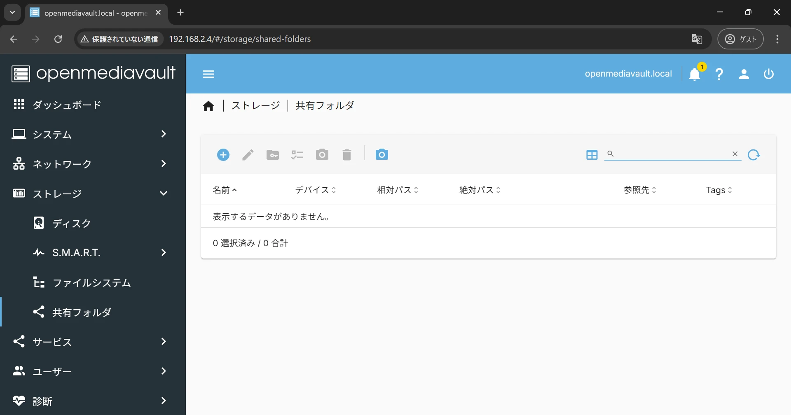

プラスアイコンをクリックして共有フォルダの作成画面を開きます。

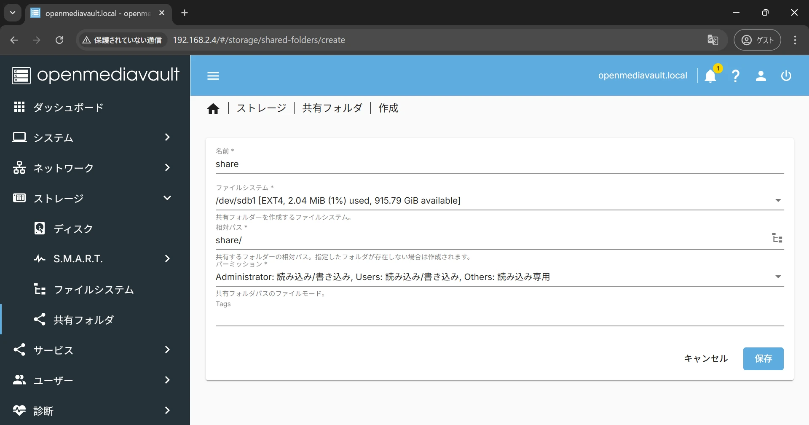

共有フォルダの名前を入力しましょう。クライアントPCは、ここで設定した名前のフォルダに対してアクセスすることになります。

先ほど作成したファイルシステムを選択し、共有フォルダの設定を保存しましょう。

## SMB/CIFSの設定

SMB/CIFSの設定を行います。メニューから「SMB/CIFS > 設定」を選択し、SMB/CIFSの設定画面を開きましょう。

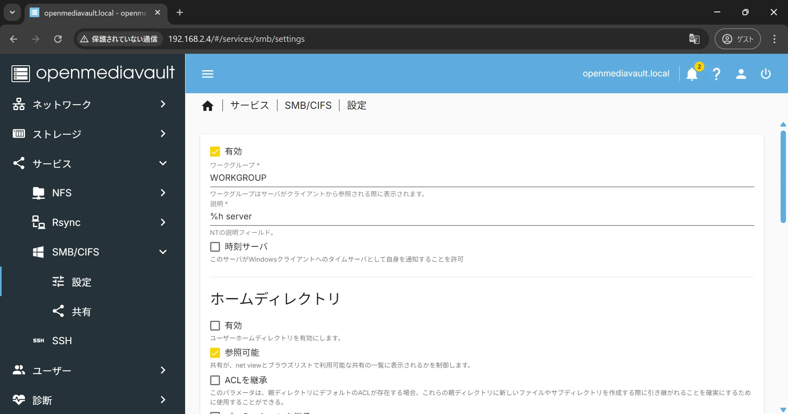

有効にチェックを入れて保存します。

次に、メニューから「SMB/CIFS > 共有」を選択し、SMB/CIFSの共有設定画面を開きましょう。

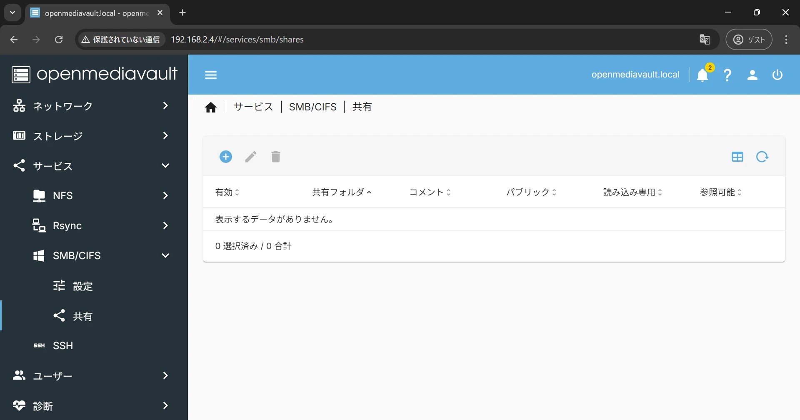

プラスアイコンをクリックして作成画面を開きます。

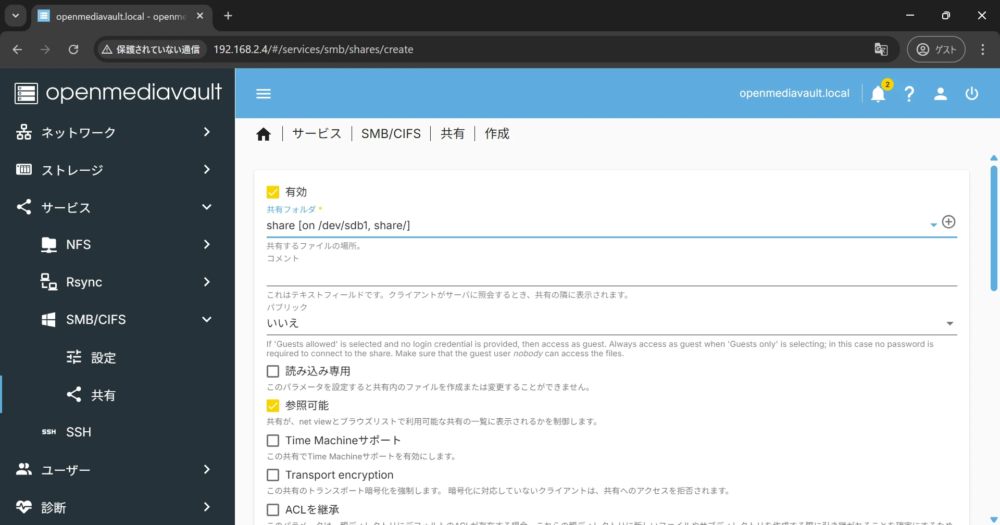

共有フォルダで、先ほど作成した共有フォルダを選択し、設定を保存しましょう。

## ユーザーの作成

共有フォルダにアクセスするユーザーを作成します。メニューから「ユーザー > ユーザー」を選択し、ユーザーの設定画面を開きましょう。

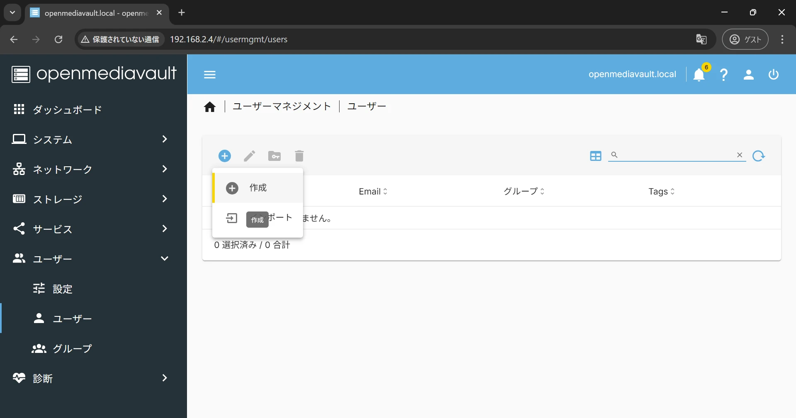

プラスアイコンをクリックしてユーザー作成画面を開きます。

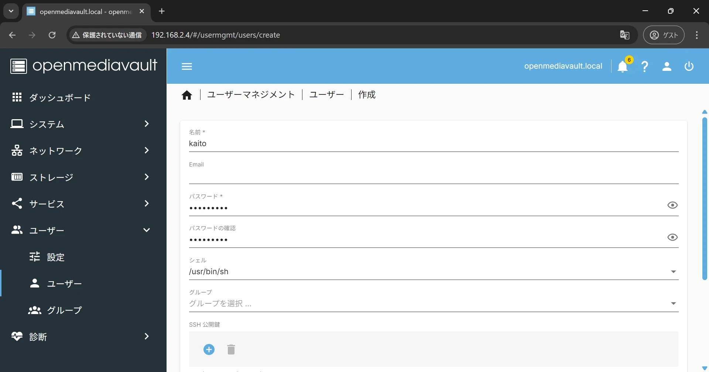

名前とパスワードを入力して保存します。この時入力した情報が、共有フォルダにアクセスする時に必要になります。

OpenMediaVaultで必要な設定は以上です。最後にクライアントPCから共有フォルダにアクセスしてみましょう。

## 共有フォルダにアクセス

Windowsのエクスプローラーから、OpenMediaVaultで作成した共有フォルダにアクセスしてみましょう。

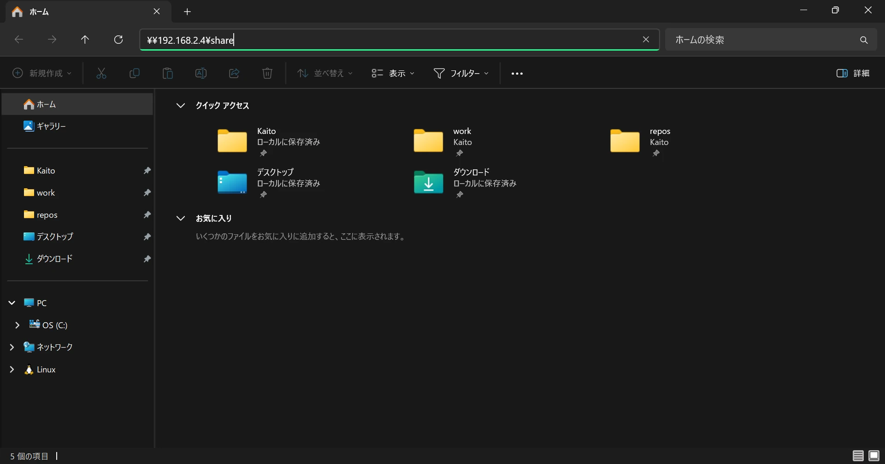

ウィンドウ上部にある入力欄に共有フォルダへのパスを入力します。

```
\\<サーバーのIPアドレス>\<共有フォルダ>
```

入力すると、ネットワーク資格情報の入力が求められます。

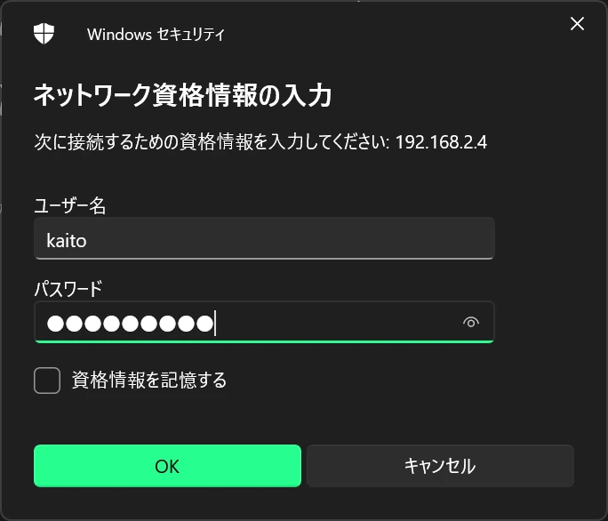

OpenMediaVaultで作成したユーザーの名前とパスワードを入力し、OKを押しましょう。

クライアントPCでログインしているユーザーと、OpenMediaVaultで作成したユーザーの名前、パスワードが一致している場合、資格情報の入力はスキップされます。

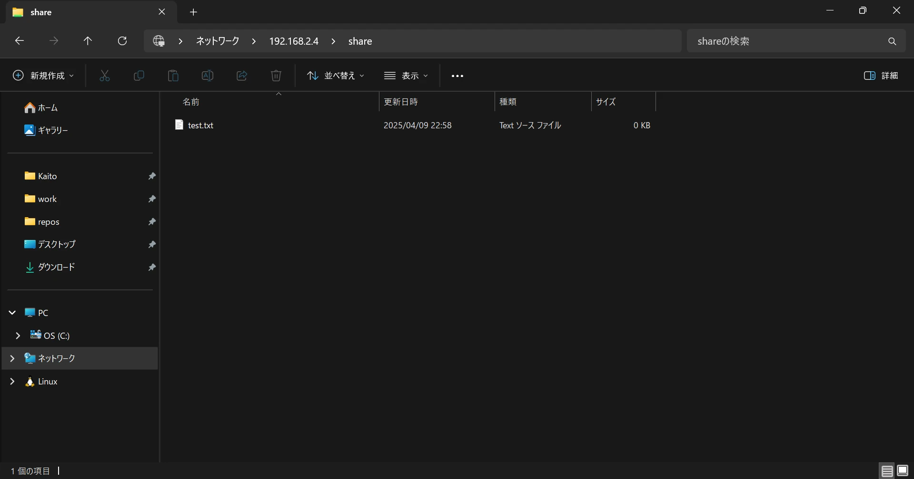

共有フォルダにアクセスできました。また、適当なファイルを作成して書き込みできることも確認できました。

以上で、OpemMediaVaultでのNASの構築は完了です。
