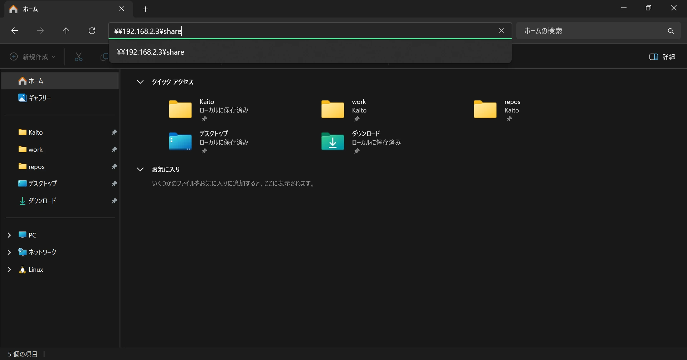
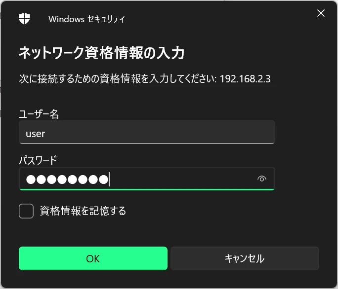
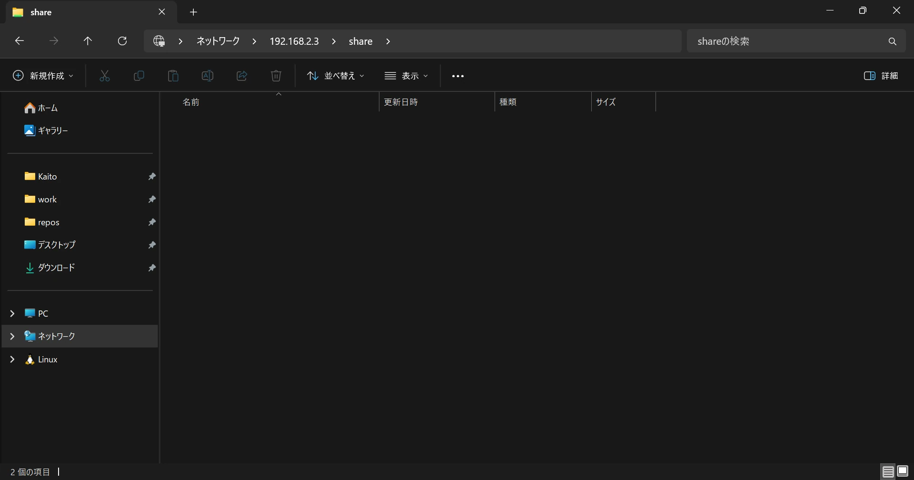

今回は、Sambaを使用して、Windowsからアクセスできるファイルサーバーを構築します。

## はじめに

サーバーのハードウェアには、GMKtecのNucBox M5 Plusを選択しました。



ミニPCにはDebianをインストールしているため、そこにSambaをインストールしてファイルサーバーを構築していきます。

新たにDebianをインストールする場合は、「[Debianをインストールする](/blog/install-debian)」の記事も参考にしてください。

## Sambaのインストール

aptでSambaをインストールします。

```
sudo apt install samba
```

Sambaのインストールはこれで完了です。依存パッケージは自動でインストールされます。

## パーティションの作成

共有フォルダを作成したいディスクにパーティションを作成します。まずは`lsblk`でディスクの一覧を確認します。

```
kaito@file:~$ lsblk
NAME   MAJ:MIN RM   SIZE RO TYPE MOUNTPOINTS
sda      8:0    0    32G  0 disk
|-sda1   8:1    0    31G  0 part /
|-sda2   8:2    0     1K  0 part
`-sda5   8:5    0   975M  0 part [SWAP]
sdb      8:16   0 931.5G  0 disk
sr0     11:0    1  1024M  0 rom
```

`sdb`が今回共有フォルダを作成したいディスクです。`fdisk`コマンドを使用して`sdb`にパーティションを作成します。

```
kaito@file:~$ sudo fdisk /dev/sdb

Welcome to fdisk (util-linux 2.38.1).
Changes will remain in memory only, until you decide to write them.
Be careful before using the write command.

Device does not contain a recognized partition table.
Created a new DOS (MBR) disklabel with disk identifier 0x278ce66c.

Command (m for help): n
Partition type
   p   primary (0 primary, 0 extended, 4 free)
   e   extended (container for logical partitions)
Select (default p):

Using default response p.
Partition number (1-4, default 1):
First sector (2048-1953525167, default 2048):
Last sector, +/-sectors or +/-size{K,M,G,T,P} (2048-1953525167, default 1953525167):

Created a new partition 1 of type 'Linux' and of size 931.5 GiB.

Command (m for help): w
The partition table has been altered.
Calling ioctl() to re-read partition table.
Syncing disks.
```

実際にパーティションが作成されたか、もう一度`lsblk`でディスク一覧を表示して確認します。

```
kaito@file:~$ lsblk
NAME   MAJ:MIN RM   SIZE RO TYPE MOUNTPOINTS
sda      8:0    0    32G  0 disk
|-sda1   8:1    0    31G  0 part /
|-sda2   8:2    0     1K  0 part
`-sda5   8:5    0   975M  0 part [SWAP]
sdb      8:16   0 931.5G  0 disk
`-sdb1   8:17   0 931.5G  0 part
sr0     11:0    1  1024M  0 rom
```

パーティション`sdb1`が追加されていることを確認できました。次はこのパーティションにファイルシステムを作成します。

## ファイルシステムの作成

`mkfs`コマンドを使用して、先ほど作成した`sdb1`パーティションにExt4でファイルシステムを作成します。

```
kaito@file:~$ sudo mkfs -t ext4 /dev/sdb1
mke2fs 1.47.0 (5-Feb-2023)
Discarding device blocks: done
Creating filesystem with 244190390 4k blocks and 61054976 inodes
Filesystem UUID: 2cc13138-06d1-4c28-ae9f-fc126067921a
Superblock backups stored on blocks:
        32768, 98304, 163840, 229376, 294912, 819200, 884736, 1605632, 2654208,
        4096000, 7962624, 11239424, 20480000, 23887872, 71663616, 78675968,
        102400000, 214990848

Allocating group tables: done
Writing inode tables: done
Creating journal (262144 blocks): done
Writing superblocks and filesystem accounting information: done
```

ファイルシステムの作成が完了しました。

## ファイルシステムのマウント

先ほど作成したファイルシステムをマウントします。まずは`ls -l /dev/disk/by-uuid/`と打ってディスクパーティションのUUIDを確認します。

```
kaito@file:~$ ls -l /dev/disk/by-uuid/
total 0
lrwxrwxrwx 1 root root 10 Apr 20 01:05 2cc13138-06d1-4c28-ae9f-fc126067921a -> ../../sdb1
lrwxrwxrwx 1 root root 10 Apr 20 00:57 6ee6b083-0585-45dd-b3d2-2add948dd8f3 -> ../../sda1
lrwxrwxrwx 1 root root 10 Apr 20 00:57 837625f1-5be2-4aed-9a8a-cbac1e7c29cc -> ../../sda5
```

これは、各ディスクパーティションをUUIDで示したシンボリックリンクを一覧表示するコマンドです。マウントさせたいパーティションのUUIDが`2cc13138-06d1-4c28-ae9f-fc126067921a`であることが確認できました。

今確認したパーティションをマウントさせるディレクトリを作成しましょう。今回は`/srv/share`というディレクトリを作成します。

```
sudo mkdir /srv/share
```

ディレクトリが作成されました。今作成したディレクトリに先ほど作成したファイルシステムが自動でマウントされるように設定していきます。

自動マウントの設定は`/etc/fstab`ファイルで設定できます。テキストエディタでファイルを開いて設定を変更しましょう。以下は自動マウントの例です。

```
# <file system> <mount point> <type> <options> <dump> <pass>
UUID=2cc13138-06d1-4c28-ae9f-fc126067921a /srv/share ext4 defaults,nofail 0 2
```

設定はスペースで6つのフィールドに区切られています。

- file system  
  マウントするファイルシステム。
- mount point  
  ファイルシステムがマウントされるディレクトリ。
- type  
  マウントするファイルシステムの種別。ext4やbtrfsなど。
- options  
  ファイルシステムのマウントオプション。ファイルシステム固有の設定もあります。
- dump  
  `dump`コマンドによるバックアップ対象にするかどうかを指定します。1ならバックアップ対象に、0ならdumpの対象外になります。
- pass  
  起動時に`fsck`がチェックする順番を指定します。1はチェックの優先度が一番高いです。ルートファイルシステムは1である必要があります。その他のファイルシステムでは2を指定しましょう。0を指定するとチェックされません。

設定を変更したら以下のコマンドでマウントさせます。

```
sudo systemctl daemon-reload
sudo mount -a
```

これにより、`/etc/fstab`の内容に沿ってマウントが実行されます。マウントできたか`df`コマンドで確認してみましょう。

```
kaito@file:~$ df -h
Filesystem      Size  Used Avail Use% Mounted on
udev            462M     0  462M   0% /dev
tmpfs            97M  1.9M   95M   2% /run
/dev/sda1        31G  1.8G   28G   7% /
tmpfs           481M     0  481M   0% /dev/shm
tmpfs           5.0M     0  5.0M   0% /run/lock
tmpfs            97M     0   97M   0% /run/user/1000
/dev/sdb1       916G   28K  870G   1% /srv/share
```

マウントされていることを確認できました。これで自動マウントの設定は完了です。

## 共有フォルダにアクセスするグループの作成

今回は、特定のグループに所属するユーザーのみ共有フォルダにアクセスできるようにファイルサーバーを構築します。

`share`という名前のグループを作成し、共有フォルダへのアクセスを許可したいユーザーをこのグループに追加します。

```
sudo groupadd share
```

グループ追加後は、先ほど作成した共有フォルダの所有グループと、パーミッションを変更します。これにより、特定のグループに所属するユーザーだけを共有フォルダへアクセスさせることができます。

```
sudo chown root:share /srv/share
sudo chmod 2770 /srv/share
```

所有グループとパーミッションの変更が完了しました。

## Sambaの設定ファイルを編集

Sambaの設定ファイル`/etc/samba/smb.conf`を以下のように編集します。

```
[global]
server role = standalone
security = user
log file = /var/log/samba/log.%m
max log size = 1000
logging = file
panic action = /usr/share/samba/panic-action %d

[share]
path = /srv/share
read only = no
create mask = 0660
directory mask = 0770
```

保存して`sudo systemctl restart smbd`とコマンドを打ってリスタートさせましょう。

## 共有フォルダにアクセスするユーザーの追加

ファイルサーバーへ接続させるユーザーを作成します。ユーザー作成後は先ほど作成した`share`グループに所属させます。

```
sudo useradd user
sudo usermod -aG share user
```

`user`という名前のユーザーを作成しました。ユーザー作成後は`pdbedit`コマンドを使用してユーザーをデータベースに追加しましょう。ファイルサーバーへログインするためのパスワードの入力が求められます。

```
kaito@file:~$ sudo pdbedit -a user
new password: <ファイルサーバーのログインパスワード>
retype new password: <ファイルサーバーのログインパスワード>
Unix username:        user
NT username:
Account Flags:        [U          ]
User SID:             S-1-5-21-1396205738-3650286879-311231574-1001
Primary Group SID:    S-1-5-21-1396205738-3650286879-311231574-513
Full Name:
Home Directory:       \\FILE\user
HomeDir Drive:
Logon Script:
Profile Path:         \\FILE\user\profile
Domain:               FILE
Account desc:
Workstations:
Munged dial:
Logon time:           0
Logoff time:          Thu, 07 Feb 2036 00:06:39 JST
Kickoff time:         Thu, 07 Feb 2036 00:06:39 JST
Password last set:    Sun, 20 Apr 2025 01:57:46 JST
Password can change:  Sun, 20 Apr 2025 01:57:46 JST
Password must change: never
Last bad password   : 0
Bad password count  : 0
Logon hours         : FFFFFFFFFFFFFFFFFFFFFFFFFFFFFFFFFFFFFFFFFF
```

ユーザーの追加が完了しました。

これで必要な設定は以上です。最後にクライアントPCから共有フォルダにアクセスしてみましょう。

## 共有フォルダにアクセス

Windowsのエクスプローラーから、Sambaで作成した共有フォルダにアクセスしてみましょう。



ウィンドウ上部にある入力欄に共有フォルダへのパスを入力します。

```
\\<サーバーのIPアドレス>\<共有フォルダ>
```

入力すると、ネットワーク資格情報の入力が求められます。



Sambaで作成したユーザーの名前とパスワードを入力し、OKを押しましょう。

クライアントPCでログインしているユーザーと、Sambaで作成したユーザーの名前、パスワードが一致している場合、資格情報の入力はスキップされます。



共有フォルダにアクセスできました。以上で、Sambaでのファイルサーバーの構築は完了です。
