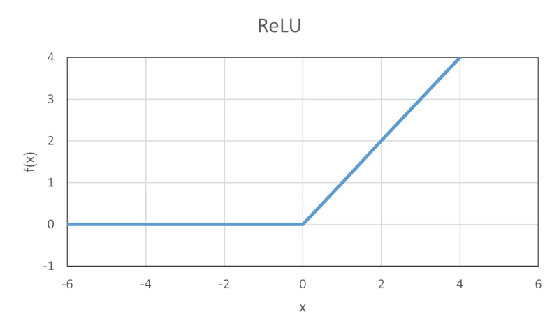

ReLU関数は、機械学習やニューラルネットワークなどの分野でよく使用される関数です。ランプ関数とも言います。

ここでは、C言語でReLU関数を実装する方法について、解説します。

## ReLU関数とは

ReLU関数は、ニューラルネットワークにおいて最も一般的に使われる活性化関数の一つです。この関数は、入力が \\( 0 \\) 以下の場合は出力が \\( 0 \\) で、\\( 0 \\) より大きい場合は入力をそのまま出力します。

具体的には、ReLU関数は以下の式で表されます。

\\[ f(x) = max(0, x) \\]

ここで、 \\( x \\) は入力値であり、 \\( f(x) \\) はReLU関数の出力値です。



ReLU関数は、シンプルで計算が効率的であることが特徴です。ニューラルネットワークにおいて非線形な特徴マップを生成することができるため、深層学習において広く使用されています。

## ReLU関数の実装

以下に、ReLU関数の実装例を示します。

```c
double relu(double x)
{
    return (x > 0.0) ? x : 0.0;
}
```

`relu`関数は、引数として \\( x \\) を受け取り、ReLU関数の計算結果を戻り値として返します。
