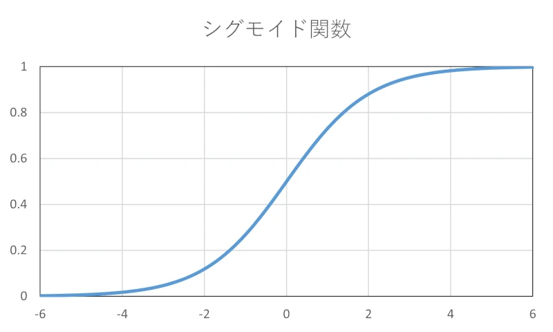

シグモイド関数は、機械学習やニューラルネットワークなどの分野でよく使用される関数です。

ここでは、C言語でシグモイド関数を実装する方法について、解説します。

## シグモイド関数とは

シグモイド関数は、入力値を \\( 0 \\) から \\( 1 \\) の範囲に変換する非線形の関数です。この関数は、機械学習やニューラルネットワークなどの分野で広く使用され、入力値を確率のように扱うことができます。

シグモイド関数は、次の式で表されます。

\\[ f(x) = \frac{1}{1 + e^{-x}} \\]

ここで、 \\( e \\) は自然対数の底であり、 \\( x \\) は入力値を表します。この関数は、 \\( x \\) を入力として受け取り、それを \\( 0 \\) から \\( 1 \\) の範囲に正規化した値を返します。



シグモイド関数は、入力値が大きくなるにつれて、出力値が \\( 1 \\) に近づき、入力値が小さくなるにつれて、出力値が \\( 0 \\) に近づく性質を持っています。

## シグモイド関数の実装

以下に、シグモイド関数の実装例を示します。

```c
#include <math.h>

double sigmoid(double x)
{
    return 1.0 / (1.0 + exp(-x));
}
```

`sigmoid`関数は、引数として \\( x \\) を受け取り、シグモイド関数の計算結果を戻り値として返します。

自然対数の底 \\( e \\) のべき乗を求めるために、`exp`関数を利用しています。利用するには`math.h`をインクルードする必要があります。

