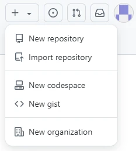
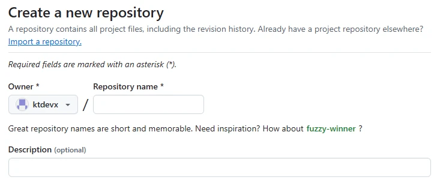
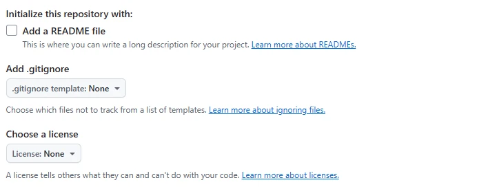

GitHubでリポジトリを作成する手順は非常にシンプルです。以下に、具体的な手順を説明します。

## リポジトリ作成ページを開く

[GitHub](https://github.com/)にアクセスし、アカウントにログインします。

トップページの右上にある「+」アイコンをクリックし、ドロップダウンメニューから「New repository」を選択します。

## リポジトリの基本情報を入力

リポジトリの所有者、名前、説明を入力します。

- Owner  
  リポジトリを所有するアカウントや組織を選びます。  
  自分の個人アカウントか、組織アカウントのどちらかを選択します。
- Repository name  
  リポジトリの名前を入力します。
- Description  
  リポジトリの説明を入力します。

## 可視性の設定

リポジトリの可視性を設定します。

- Public  
  リポジトリを公開して、誰でも閲覧できるようにします。
- Private  
  リポジトリを非公開にして、自分や招待されたメンバーのみがアクセスできるようにします。

## README / .gitignore / LICENSEの追加

リポジトリにREADME、.gitignore、LICENSEなどの基本となるファイルの追加を行います。

- Add a README file  
  このチェックボックスをオンにすると、リポジトリにREADME.mdファイルが自動で作成されます。  
  README.mdファイルは、リポジトリの概要や使用方法を記述する場所です。
- Add .gitignore  
  プログラミング言語やフレームワークを選択し、不要なファイルやフォルダをGitに追跡させないための.gitignoreファイルを追加できます。  
  これにより、特定のファイルやディレクトリがリポジトリにコミットされないように設定できます。
- Choose a license  
  どのライセンスで公開するかを選択できます。  
  リポジトリのライセンスは、他の人がどのようにコードを使用できるかを決めます。

## リポジトリを作成する

すべての設定が完了したら、ページ下部にある「Create repository」ボタンをクリックします。

これによりリポジトリが作成され、リポジトリのメインページが表示されます。ここから、ローカルにクローンしたり、ファイルを追加したり、リポジトリの管理が行えます。
