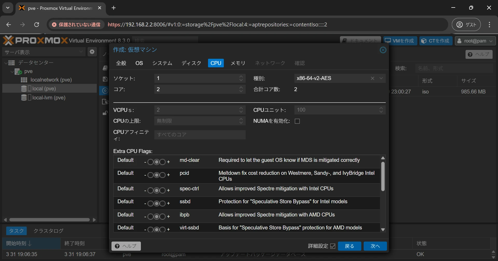
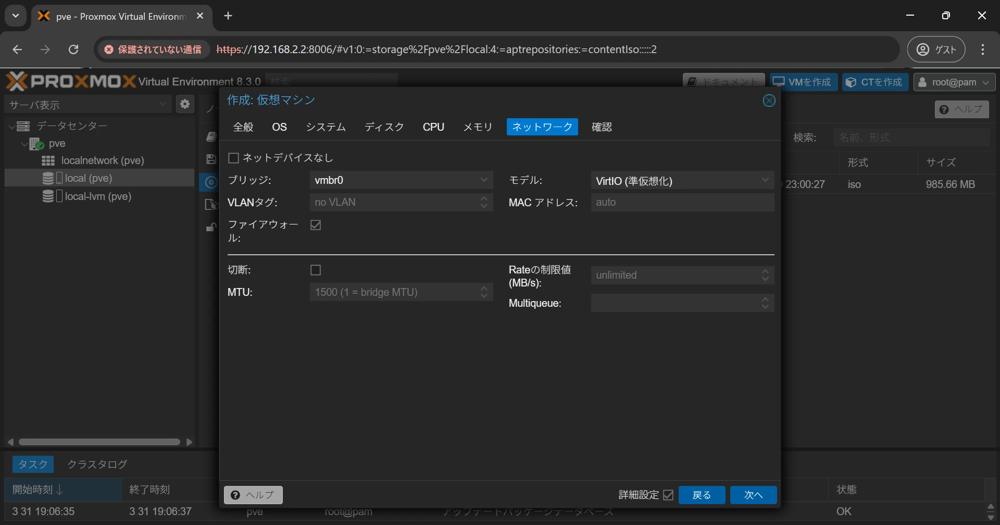

Proxmox VE(Virtual Environment)は、KVMとLXCをベースにしたオープンソースの仮想化プラットフォームで、Web UIから簡単に仮想マシンとコンテナの作成、管理が行えます。

ここでは、Proxmox VEで仮想マシンを作成する方法について説明します。

## ISOイメージのダウンロード

仮想マシンにインストールするゲストOSのISOイメージをダウンロードしましょう。

今回はNASプラットフォームの[OpenMediaVault](https://www.openmediavault.org/)を選択しました。

## ISOイメージのアップロード

ISOイメージのアップロードはProxmox VEの管理画面から行えます。

管理画面左端で対象ノードから「local (<対象ノード>)」を選択、「ISOイメージ」を押して、ISOイメージの管理画面を開きます。

「アップロード」を選択してISOイメージのアップロード画面を開きましょう。

ダウンロードしたISOイメージを選択してアップロードします。ISOイメージと一緒に公開されているハッシュ値を入力して検証することもできます。

アップロードが完了するまでしばらく待ちましょう。

ISOイメージがアップロードできました。

今回はPCからISOイメージをアップロードしましたが、「URLからダウンロード」を選択すれば、ダウンロードページのURLを指定してISOイメージをダウンロードすることができます。

## 仮想マシンの作成

画面右上の「VMを作成」を押して仮想マシンの作成画面を開きましょう。

### 全般設定

仮想マシンを作成したいノードを指定し、仮想マシンの名前を入力します。VM IDは連番が割り当てられます。特に指定がなければそのままにしましょう。

Proxmox VE起動時に仮想マシンを自動で起動したい場合は、「ブート時に起動」にチェックを入れましょう。

設定したら「次へ」を押してOSの設定画面を開きましょう。

### OS設定

仮想マシンのOSの設定を行います。

アップロードしたISOイメージを使用するため、「CD/DVD イメージファイル (iso) を使用」にチェックを入れ、アップロードしたISOイメージを選択しましょう。

仮想マシンのOSの種別を選択し、「次へ」を押してシステムの設定画面を開きましょう。

### システム設定

システムに関する設定を行います。

ここは特に指定がなければ変更せずにそのままでも問題ありません。

仮想マシン上でQEMUゲストエージェントをインストールする場合は、Qemuエージェントにチェックを入れましょう。

QEMUゲストエージェントは仮想マシン内で動作するもので、Proxmox VEからlibvirtを介して、仮想マシン側でコマンドを実行するための仕組みです。

設定したら「次へ」を押してディスクの設定画面を開きましょう。

### ディスク設定

ディスクに関する設定を行います。

バス/デバイスの設定は、特に指定がなければSCSIを選択しましょう。これによりシステム設定で選んだSCSIコントローラに接続されます。VirtIO SCSIまたはVirtIO SCSI Singleを選択していると高速にディスクアクセスが可能です。

ストレージを選択してディスクサイズを入力したら、「次へ」を押してCPUの設定画面を開きましょう。

### CPU設定

CPUに関する設定を行います。

ここでは主に、仮想マシンに割り当てる仮想コアの数を指定します。割り当てられる合計のコア数はソケット数×コア数で決まります。

ソケットの設定で値を2以上にすることで、仮想マシンに対してまるで複数のCPUが搭載されているようにみせることができます。通常は1で問題ありません。

種別の設定では、仮想マシンにみせるCPUの種別を選択できます。特に指定がなければそのままで問題ありません。

設定したら「次へ」を押してメモリの設定画面を開きましょう。

### メモリ設定

メモリに関する設定を行います。

仮想マシンに割り当てるメモリを入力しましょう。

Ballooningとは、仮想マシンに割り当てるメモリを動的に調整するための機能です。リソースを節約できる一方で、パフォーマンスが不安定になることもあるため、「Ballooningデバイス」のチェックは外しておくことを推奨します。

設定したら「次へ」を押してネットワークの設定画面を開きましょう。

### ネットワーク設定

ネットワークの設定を行います。

使用したいブリッジを選択し、モデルは特に指定がなければVirtIOのままとしましょう。

設定したら「次へ」を押して確認画面を開きましょう。

### 設定の確認

設定した内容が表示されます。特に問題がなければ「完了」を押して仮想マシンの設定を終了します。

## ゲストOSのインストール

全般設定で指定したノードに仮想マシンが作成されています。

画面右上の「開始」を押した後、「コンソール」を押して、ゲストOSのインストール画面を開きましょう。

後は通常通り、ゲストOSをインストールしましょう。
