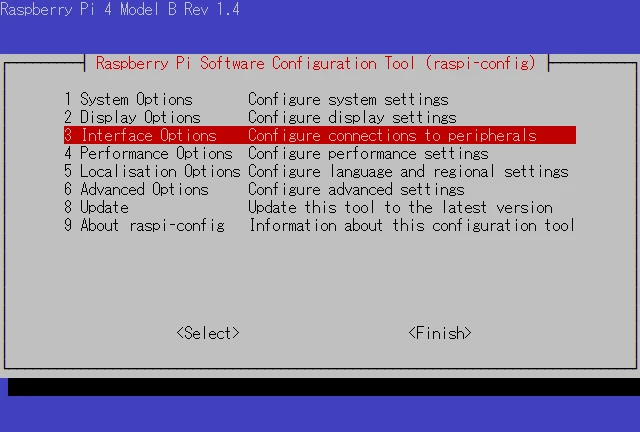
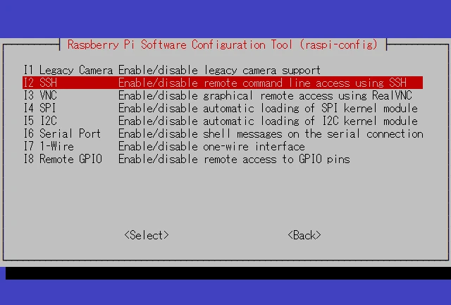
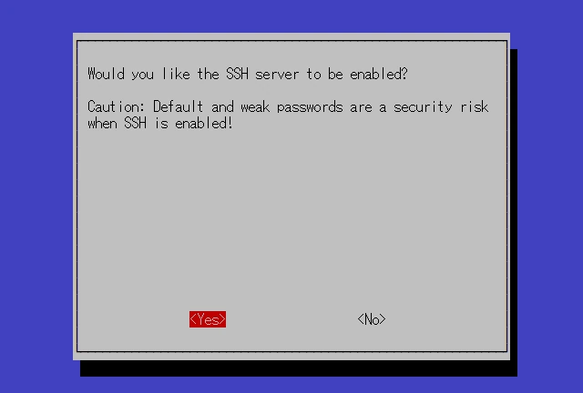
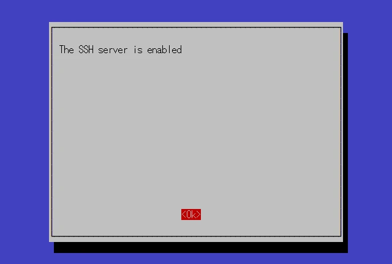
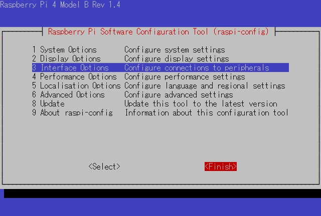

Raspberry Pi OSは、Raspberry Pi財団が提供している、Raspberry Pi用のOSです。SSH接続を有効にすることで、リモートでRaspberry Piにアクセスすることができます。

ここでは、Raspberry Pi OSでSSH接続を有効化する方法について説明します。

## 設定ツールの起動

以下のコマンドを実行し、Raspberry Piの設定ツールを起動します。

```
sudo raspi-config
```

## SSHサーバーの有効化



コマンドを実行すると、設定画面が表示されます。Interface Optionsにカーソルを合わせ、Enterキーを押します。



有効/無効の設定を行うインターフェースが表示されます。SSHにカーソルを合わせ、Enterキーを押します。



SSHサーバーを有効化するか聞かれるため、Yesを選択します。



SSHサーバーが有効化されました。Enterキーを押し、設定画面のトップへ戻ります。



Finishを選択し、設定ツールを閉じます。

## SSHサーバーの再起動

以下のコマンドを実行し、SSHサーバーを再起動します。

```
sudo systemctl restart ssh
```

以上で、Raspberry Pi OSでSSH接続が有効になりました。これで、リモートコンピューターからSSHを使用してRaspberry Piにアクセスすることができます。