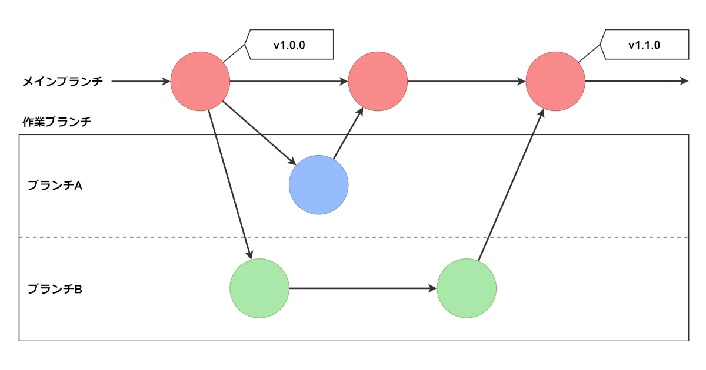

個人開発においても、Gitを使った運用方法は重要です。Gitを使うことで、バージョン管理やコードの履歴管理が容易になります。

以下では、個人開発でおすすめのGitワークフローについて解説します。

## ワークフローの概要



このワークフローでは、機能やバグ修正ごとに作業ブランチを作成して開発を行い、最終的にメインブランチにマージするという流れを取ります。

開発者は、新しい機能を実装するために作業ブランチを作成し、開発を行います。完成した機能は、メインブランチにマージされます。この手法により、開発者は機能ごとに分離された開発環境で作業し、本番環境への影響を最小限に抑えることができます。

## メインブランチから作業ブランチを作成

各機能やバグ修正毎に別々のブランチを作成し、変更を加えるためにチェックアウトします。ブランチ名は、後から見てもわかりやすい名前をつけることを心がけましょう。

```
git checkout <メインブランチ>
git checkout -b <作業ブランチ>
```

これにより、メインブランチから作業ブランチが作成され、チェックアウトされます。

## 作業ブランチ上で開発

作成した作業ブランチで機能の追加やバグの修正を行います。コード変更後は、変更を行ったファイルを追加し、コミットとプッシュを行います。

```
git add <ファイル名>
git commit
git push origin -u <作業ブランチ>
```

これにより、変更を行った内容がリモートリポジトリに反映されます。

## メインブランチに変更をマージ

開発が完了したら、メインブランチへ変更内容をマージします。

```
git checkout <メインブランチ>
git merge <作業ブランチ>
git push
```

これにより、作業ブランチの変更内容がメインブランチにマージされ、リモートリポジトリに反映されます。

## 作業ブランチの削除

不要なブランチが多数存在すると、プロジェクト内のブランチの可視性や、保守性が低下します。

そのため、メインブランチへマージ後は、不要となった作業ブランチを削除します。

```
git branch -d <作業ブランチ>
git push -d origin <作業ブランチ>
```

これにより、ローカルリポジトリとリモートリポジトリから作業ブランチが削除されます。

## バージョンタグの作成

このワークフローでは、メインブランチの変更が機能単位ごとに行われるため、どのリビジョンをリリースしたかを簡単に見つけることができません。

そのため、リリース時のリビジョンにバージョンタグを作成することで、リビジョンとリリースとの関係を明確にし、リリースの管理を容易にします。

```
git tag <リリースバージョン>
git push origin <リリースバージョン>
```

これにより、リリースバージョンの名前でタグが作成され、リモートリポジトリに反映されます。
