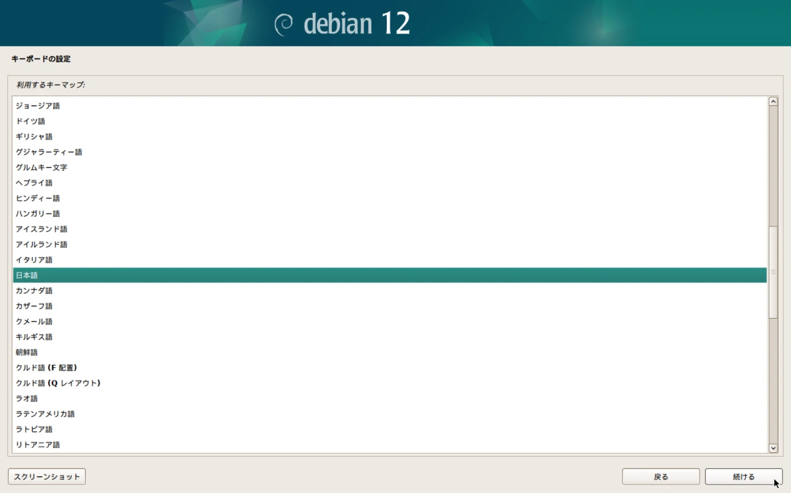
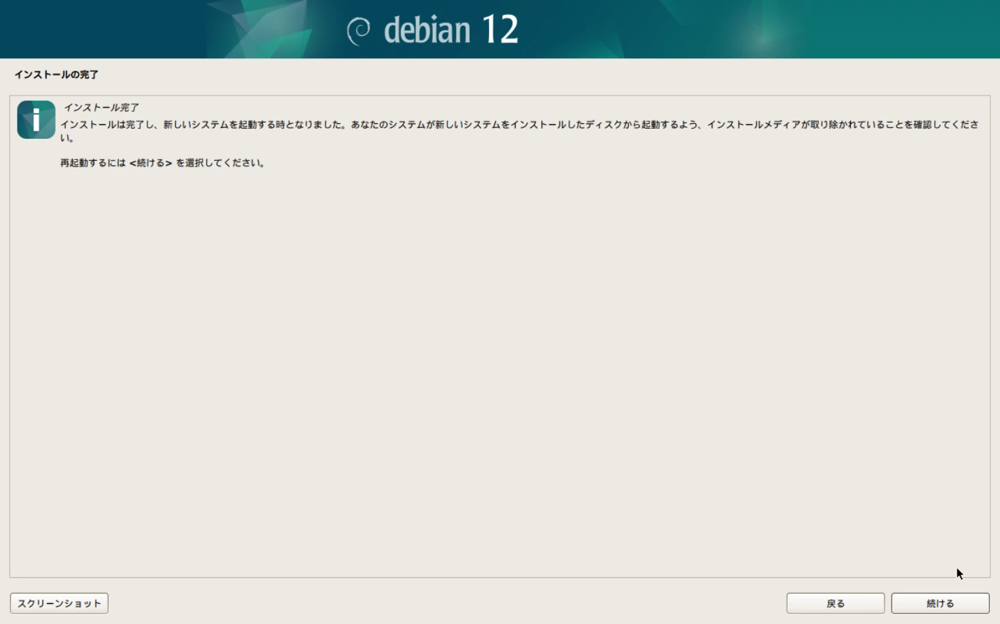

ここでは、Debianをインストールする方法について説明します。

## はじめに

サーバーのハードウェアには、GMKtecのNucBox M5 Plusを選択しました。



ミニPCには仮想化プラットフォームのProxmox VEをインストールしているため、そこに仮想マシンを作成してDebianをインストールします。

Proxmox VE上の仮想マシンにインストールする場合は、「[Proxmox VEで仮想マシン(VM)を作成する](/blog/create-vm-in-proxmox-ve)」の記事も参考にしてください。

## Debianのダウンロード

[Debianのダウンロードページ](https://www.debian.org/distrib/)から、ISOイメージをダウンロードします。今回はDebian 12.10.0をダウンロードしました。

## インストール用USBメモリの作成

先ほどダウンロードしたISOイメージを、USBメモリに書き込みます。Win32 Disk Imagerなどのイメージ書き込みソフトを使用してUSBメモリへ書き込みましょう。

Win32 Disk Imagerを使用した書き込み方法については、[Win32 Disk Imagerのインストールと使い方](/blog/install-win32-disk-imager)で詳しく説明しています。そちらを参考にしてください。

## Debianのインストール

DebianをインストールしたいPCにUSBメモリを接続し、PCを起動してUSBメモリからブートさせましょう。起動するとDebianのインストール画面が表示されます。

### インストール方法の選択

インストール方法が表示されます。「Graphical Install」を選択してEnterキーを押すか、自動でインストールが開始されるまで待ちましょう。

### 言語の設定

インストール中に表示される言語の設定を行います。日本語を選択して「Continue」を押しましょう。

### ロケールの設定

ロケールの設定を行います。この設定はタイムゾーンの設定やシステムのロケールの選択の支援に使用されます。

日本を選択して「続ける」を押しましょう。

### キーボードの設定

キーボードの設定を行います。使用しているキーボードの配列に合わせて選択し、「続ける」を押しましょう。

### ホスト名の設定

サーバーのホスト名を設定します。

デフォルトは`debian`になっています。特に指定がなければそのままでも問題ありません。ホスト名を入力して「続ける」を押しましょう。

### ドメイン名の設定

サーバーのドメイン名を設定します。

デフォルトは空欄になっています。特に指定がなければそのままでも問題ありません。ドメイン名を入力して「続ける」を押しましょう。

### 管理者のパスワードの設定

管理者ユーザー(`root`)のパスワードを設定します。

パスワードを入力すると`su`コマンドで`root`ユーザーへのログインが可能になります。

空にすると`root`ユーザーへのログインが制限され、後に作成するユーザーに`sudo`権限が与えられます。

ユースケースに合わせて設定し、「続ける」を押しましょう。

### ユーザーの表示名の設定

非管理者権限のユーザーを作成します。作成するアカウントを所有するユーザーのフルネームを入力しましょう。

この情報はユーザーの本名を表示、利用するプログラムのほか、このユーザーから送られるメールのデフォルトの発信元といった形で使用されます。一般的には本名を入力しましょう。

ユーザーの表示名を入力して「続ける」を押しましょう。

### ユーザー名の設定

非管理者権限のユーザーを作成します。作成するアカウントのユーザー名を入力します。

ユーザー名の先頭は小文字のアルファベットでなければなりません。ユーザー名を入力して「続ける」を押しましょう。

### パスワードの設定

非管理者権限のユーザーを作成します。作成するアカウントのパスワードを入力します。

パスワードを入力して「続ける」を押しましょう。

### パーティショニング方法の設定

パーティショニングの方法を設定します。

特に指定がなければ「ガイド・ディスク全体を使う」を選択して「続ける」を押しましょう。

### パーティショニングするディスクの設定

パーティショニングするディスクを設定します。

ディスクを選択して「続ける」を押しましょう。

### パーティショニング機構の設定

パーティショニング機構の設定をします。

特に指定がなければ「すべてのファイルを1つのパーティションに」を選択して「続ける」を押しましょう。

### パーティションの詳細設定

パーティションの詳細が設定できます。

特に指定がなければデフォルトのまま、「パーティショニングの終了とディスクへの変更の書き込み」を選択して「続ける」を押しましょう。」

### パーティションの作成

作成されるパーティションの最終確認です。

内容に問題がなければ「はい」にチェックを入れ、「続ける」を押しましょう。

### メディアの検査

パッケージマネージャー(apt)によって使用される追加のメディアの検査を指定できます。

特に指定がなければ「いいえ」にチェックを入れ、「続ける」を押しましょう。

### Debianパッケージリポジトリの設定

Debianのパッケージリポジトリの設定を行います。「日本」を選択して「続ける」を押しましょう。

パッケージリポジトリとそのミラーが一覧で表示されます。特に指定がなければ`deb.debian.org`で問題ありません。

リポジトリを選択して「続ける」を押しましょう。

### HTTPプロキシの設定

HTTPプロキシの設定を行います。

プロキシを介してインターネットへアクセスする必要がある場合は、プロキシ情報を入力しましょう。必要ない場合は空のままにします。

設定したら「続ける」を押しましょう。

### Debian Popularity Contestの設定

このシステムで最も利用したパッケージについての統計を、Debianコミュニティに匿名で提供するようシステムを設定できます。

参加することを選ぶと、自動送信スクリプトが毎週1回自動的に実行され、Debianコミュニティに統計が送られます。収集された統計は、[Debian Popularity Contest](https://popcon.debian.org/)で確認できます。

いずれかを選択して「続ける」を押しましょう。

### インストールするソフトウェアの選択

デフォルトでは、システムのコア機能のみがインストールされます。ここで追加でインストールするソフトウェアを選択することができます。

デスクトップPCとして使用する場合など、GUI環境が必要な場合は「Debian デスクトップ環境」と「GNOME」にチェックを入れましょう。

サーバー用途で使用する場合など、リモート接続環境が必要な場合は「SSHサーバー」にチェックを入れましょう。

インストールするソフトウェアを選択したら「続ける」を押しましょう。

### ブートローダのインストール

GRUBブートローダーをインストールします。「はい」にチェックを入れ、「続ける」を押しましょう。

GRUBブートローダーをインストールするデバイスを選択し、「続ける」を押します。インストールが完了するまで待ちましょう。

### システムの再起動

インストールに使用したUSBメモリを取り外し、「続ける」を押しましょう。

これによりシステムが再起動され、Debianが立ち上がります。

シェルのログイン画面が表示されました。Debianのインストールは完了です。
