Gitは、バージョン管理システムの一種で、プログラムや文書などの変更履歴を管理するためのツールです。

ここでは、Windows向けにGitをインストールする手順について解説します。

## インストーラーのダウンロードと実行

[公式サイト](https://gitforwindows.org/)にアクセスし、ページ中央にある「Download」をクリックしてインストーラーをダウンロードします。

その後、ダウンロードしたインストーラーを実行します。実行には管理者権限が必要です。

## ライセンスの確認

ライセンスが表示されます。

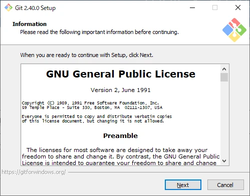

内容を確認したうえで問題がなければ「Next」をクリックし、次へ進みます。

## インストール先の選択

Gitのインストール先フォルダを選択します。

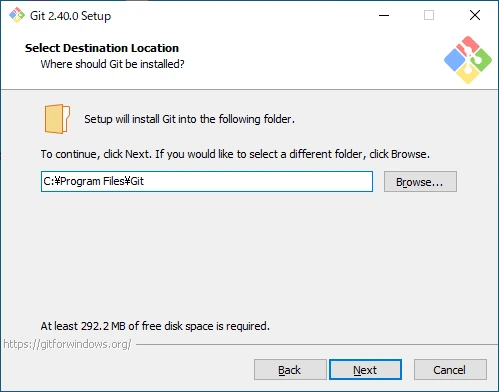

特に指定がなければデフォルトのまま「Next」をクリックし、次へ進みます。

## インストールするコンポーネントの選択

インストールするコンポーネントを選択します。

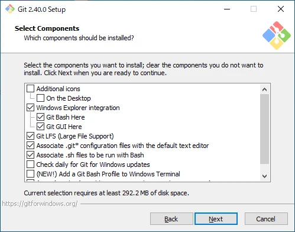

- Additional icons
  - On the Desktop  
    Git Bashのショートカットをデスクトップに追加する。
- Windows Explorer integration
  - Git Bash Here  
    右クリックで表示されるメニューにGit Bashを追加する。
  - Git GUI Here  
    右クリックで表示されるメニューにGit GUIを追加する。
- Git LFS (Large File Support)  
  Git LFSをインストールする。
- Associate .git* configuration files with the default text editor  
  拡張子が.gitから始まるファイルをデフォルトのテキストエディターに関連付ける。
- Associate .sh files to be run with Bash  
  拡張子が.shのファイルをGit Bashに関連付ける。
- Check daily for Git for Windows updates  
  Git for Windowsの更新を毎日確認する。
- Add a Git Bash Profile to Windows Terminal  
  Windows TerminalにGit Bashを追加する。
- Scalar (Git add-on to manage large-scale repositories)  
  Scalarをインストールする。

特に指定がなければデフォルトのまま「Next」をクリックし、次へ進みます。

## スタートメニューに表示するフォルダ名の設定

Windowsのスタートメニューに表示するフォルダ名を設定します。

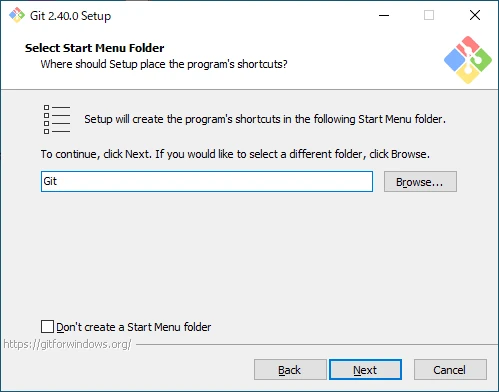

スタートメニューにフォルダを作成しない場合は「Don’t create a Start Menu folder」にチェックを入れましょう。

特に指定がなければデフォルトのまま「Next」をクリックし、次へ進みます。

## Gitで使用するエディターの選択

Gitで使用するデフォルトのエディターを選択します。

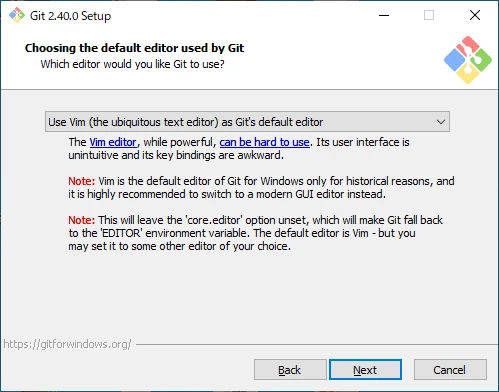

デフォルトはVimです。特に指定がなければデフォルトのまま「Next」をクリックし、次へ進みます。

## 最初に作成されるブランチ名の設定

新しいリポジトリの最初のブランチ名を設定します。

デフォルトは「master」です。GitHubではデフォルトで「main」を採用しています。

設定後は「Next」をクリックし、次へ進みます。

## 環境変数の設定

環境変数を設定します。

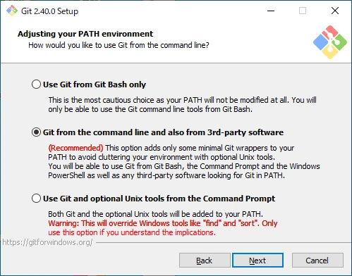

- Use Git from Git Bash only  
  環境変数を変更しない。  
  GitやUnixツールはGit Bashからのみ使用できる。
- Git from the command line and also from 3rd-party software  
  Gitのみを環境変数に追加する。  
  コマンドプロンプトやPowerShellからGitを実行することができる。  
  UnixツールはGit Bashからのみ使用できる。
- Use Git and optional Unix tools from the Command Prompt  
  GitとUnixツールを環境変数に追加する。  
  コマンドプロンプトやPowerShellからGitとUnixツールを実行することができる。

特に指定がなければデフォルトのまま「Next」をクリックし、次へ進みます。

## SSHの設定

SSHの設定をします。

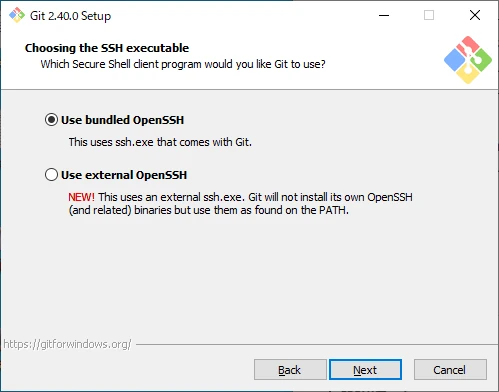

- Use bundled OpenSSH  
  Gitに付属しているssh.exeを使用する。
- Use external OpenSSH  
  外部のssh.exeを使用する。

特に指定がなければデフォルトのまま「Next」をクリックし、次へ進みます。

## SSL/TLSの設定

SSL/TLSの設定をします。

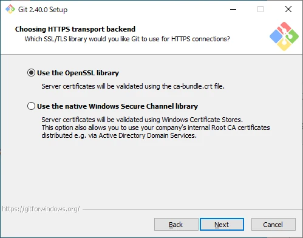

- Use the OpenSSL library  
  OpenSSLライブラリを使用する。  
  サーバー証明書は、ca-bundle.crtファイルを使って検証される。
- Use the native Windows Secure Channel library  
  WindowsのSecure Channeライブラリを使用する。  
  サーバ証明書は、Windowsの証明書ストアを使用して検証される。  
  Active Directoryドメインサービスなどで配布される社内ルートCA証明書を使用することができる。

特に指定がなければデフォルトのまま「Next」をクリックし、次へ進みます。

## 改行コードの設定

改行コードの変換設定を選択します。

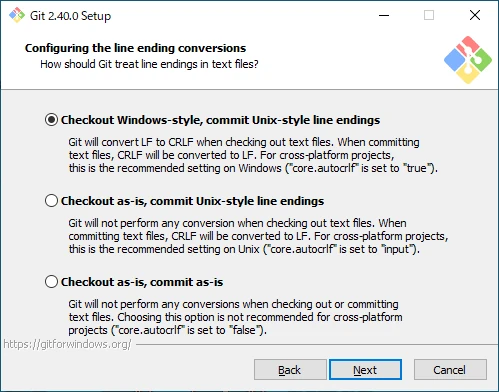

- Checkout Windows-style, commit Unix-style line endings  
  チェックアウト時にCR+LFに変換し、コミット時にLFに変換する。
- Checkout as-is, commit Unix-style line endings  
  チェックアウト時は変換を行わず、コミット時にのみLFに変換する。
- Checkout as-is, commit as-is  
  チェックアウト時にもコミット時にも変換を行わない。

デフォルトではチェックアウト時にCR+LFに変換し、コミット時にLFに変換する設定になっています。意図せぬトラブルが発生する可能性があるため、慎重に選択しましょう。

選択後は「Next」をクリックし、次へ進みます。

## ターミナルの選択

Git Bashで使用するターミナルを選択します。

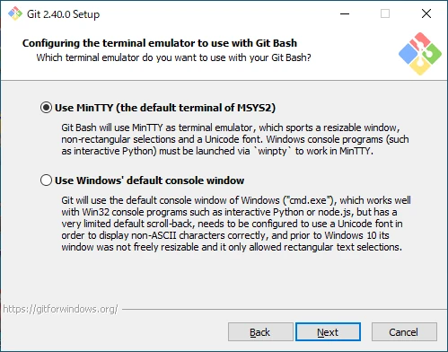

- Use MinTTY (the default terminal of MSYS2)  
  MinTTY(MSYS2の標準ターミナル)を使用する。
- Use Windows' default console window  
  Windowsの標準コンソールを使用する。

特に指定がなければデフォルトのまま「Next」をクリックし、次へ進みます。

## git pullのデフォルトの動作を選択

git pullのデフォルトの動作を選択します。

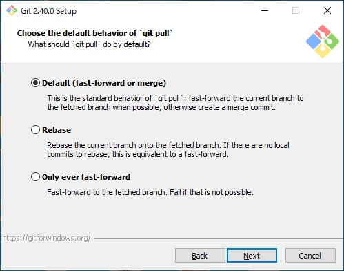

- Default (fast-forward or merge)  
  `git pull --ff`が実行される。
- Rebase  
  `git pull --rebase`が実行される。
- Only ever fast-forward  
  `git pull --ff-only`が実行される。

特に指定がなければデフォルトのまま「Next」をクリックし、次へ進みます。

## 認証補助の設定

認証補助の設定をします。

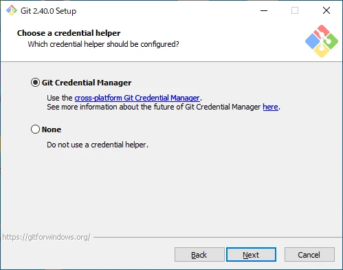

- Git Credential Manager  
  Git Credential Managerを使用する。
- None  
  認証補助を使用しない。

特に指定がなければデフォルトのまま「Next」をクリックし、次へ進みます。

## 追加オプションの設定

追加オプションの設定をします。

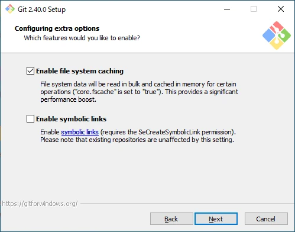

- Enable file system caching  
  キャッシュを有効にする。これによりパフォーマンスが大幅に向上する。
- Enable symbolic links  
  シンボリックリンクを有効にする。

特に指定がなければデフォルトのまま「Next」をクリックし、次へ進みます。

## 実験的なオプションの設定

実験的なオプションを設定します。

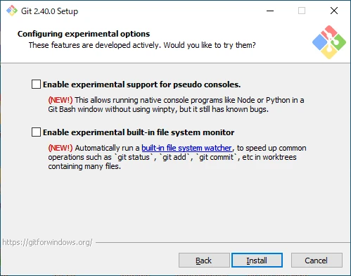

- Enable experimental support for pseudo consoles.  
  Git BashでPythonやNodeを実行できるようになる。
- Enable experimental built-in file system monitor  
  多数のファイルがある場合にGitコマンドが高速化される。

特に指定がなければデフォルトのまま「Install」をクリックし、インストールへ進みます。

## Gitをインストール

Gitのインストール中です。インストールが完了するまで待ちます。

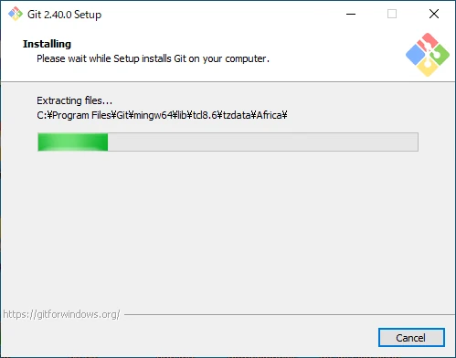

「Completing The Git Setup Wizard」と表示されればインストール完了です。「Finish」を選択してインストーラーを閉じましょう。

## 外部リンク

- [Git](https://git-scm.com/)
- [Git for Windows](https://gitforwindows.org/)
