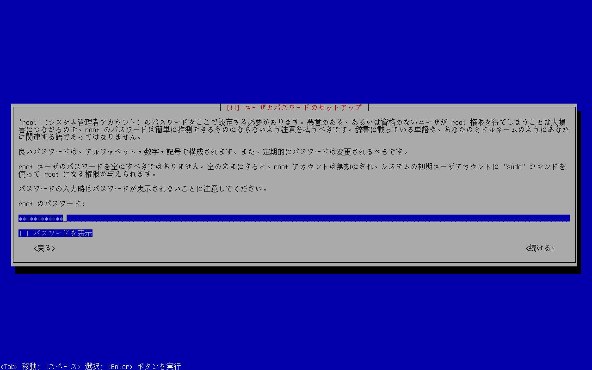

OpenMediaVault(OMV)は、DebianをベースにしたオープンソースのNASソフトウェアで、ユーザーが簡単にNASを構築できるように設計されています。

ここでは、OpenMediaVaultをインストールする方法について説明します。

## はじめに

サーバーのハードウェアには、GMKtecのNucBox M5 Plusを選択しました。



ミニPCには仮想化プラットフォームのProxmox VEをインストールしているため、そこに仮想マシンを作成してDebianをインストールします。

Proxmox VE上の仮想マシンにインストールする場合は、「[Proxmox VEで仮想マシン(VM)を作成する](/blog/create-vm-in-proxmox-ve)」の記事も参考にしてください。

## OpenMediaVaultのダウンロード

[OpenMediaVaultのダウンロードページ](https://www.openmediavault.org/download)から、ISOイメージをダウンロードします。今回はOpenMediaVault 7.4.14をダウンロードしました。

## インストール用USBメモリの作成

先ほどダウンロードしたISOイメージを、USBメモリに書き込みます。Win32 Disk Imagerなどのイメージ書き込みソフトを使用してUSBメモリへ書き込みましょう。

Win32 Disk Imagerを使用した書き込み方法については、[Win32 Disk Imagerのインストールと使い方](/blog/install-win32-disk-imager)で詳しく説明しています。そちらを参考にしてください。

## OpenMediaVaultのインストール

OpenMediaVaultをインストールしたいPCにUSBメモリを接続し、PCを起動してUSBメモリからブートさせましょう。起動するとOpenMediaVaultのインストール画面が表示されます。

### インストール方法の選択

インストール方法が表示されます。「Install」を選択してEnterキーを押すか、自動でインストールが開始されるまで待ちましょう。

### 言語の設定

インストール中に表示される言語の設定を行います。日本語を選択してEnterキーを押しましょう。

### ロケールの設定

ロケールの設定を行います。この設定はタイムゾーンの設定やシステムのロケールの選択の支援に使用されます。

日本を選択してEnterキーを押しましょう。

### キーボードの設定

キーボードの設定を行います。使用しているキーボードの配列に合わせて選択し、Enterキーを押しましょう。

### 追加コンポーネントのロード・ネットワークの自動設定

追加コンポーネントのロードや、ネットワークの自動設定が動作します。

この時、**IPv6環境下でDHCPv6の設定後にインストーラーが止まる**場合があります。原因と対処法について以下の記事にまとめているので、困ったら参考にしてください。

[OpenMediaVaultのインストールがDHCPv6の設定でスタックする](/blog/omv-installation-stuck-in-dhcpv6-configuration)

### ホスト名の設定

サーバーのホスト名を設定します。

デフォルトは`openmediavault`になっています。特に指定がなければそのままでも問題ありません。

ホスト名を入力して「<続ける>」にカーソルを合わせてEnterキーを押しましょう。

### ドメイン名の設定

サーバーのドメイン名を設定します。

デフォルトは`local`になっています。特に指定がなければそのままでも問題ありません。

ドメイン名を入力して「<続ける>」にカーソルを合わせてEnterキーを押しましょう。

### 管理者のパスワードの設定

管理者ユーザー(`root`)のパスワードを設定します。

パスワードを入力して「<続ける>」にカーソルを合わせてEnterキーを押しましょう。

確認のため再度同じパスワードを入力して「<続ける>」にカーソルを合わせてEnterキーを押しましょう。

### Debianパッケージリポジトリの設定

Debianのパッケージリポジトリの設定を行います。「日本」を選択してEnterキーを押しましょう。

パッケージリポジトリとそのミラーが一覧で表示されます。特に指定がなければ`deb.debian.org`で問題ありません。

リポジトリを選択してEnterキーを押しましょう。

### HTTPプロキシの設定

HTTPプロキシの設定を行います。

プロキシを介してインターネットへアクセスする必要がある場合は、プロキシ情報を入力しましょう。必要ない場合は空のままにします。

設定したら「<続ける>」にカーソルを合わせてEnterキーを押しましょう。

### ブートローダのインストール

GRUBブートローダーのインストール先を選択します。

GRUBブートローダーをインストールするデバイスを選択してEnterキーを押しましょう。

### システムの再起動

インストールに使用したUSBメモリを取り外し、「<続ける>」にカーソルを合わせてEnterキーを押しましょう。

これによりシステムが再起動され、OpenMediaVaultが立ち上がります。

シェルのログイン画面が表示されました。OpenMediaVaultのインストールは完了です。

## OpenMediaVaultの管理画面にアクセス

OpenMediaVaultの管理画面にアクセスしてみましょう。

ホスト名とドメイン名の組み合わせ(デフォルトは`openmediavault.local`)か、IPアドレスを指定してウェブブラウザからHTTPでアクセスします。

IPアドレスは先ほど表示されたシェルのログイン画面でも確認できます。

管理画面にアクセスするとログイン画面が表示されます。ユーザー名は`admin`、パスワードは`openmediavault`でログインできます。

## 管理画面の言語を変更

管理画面の言語はデフォルトで英語になっているため、日本語に変更します。

管理画面の右上にある人のアイコンをクリックし、「Language」にカーソルを合わせましょう。設定可能な言語が表示されるので日本語を選択します。

これにより、OpenMediaVaultの管理画面が日本語に変わります。

## 管理者のパスワードを変更

管理者ユーザー(`admin`)のパスワードはデフォルトで`openmediavault`になっています。このままでは危険なのでパスワードを変更しましょう。

管理画面の右上にある人のアイコンをクリックし、「パスワードの変更」にカーソルを合わせてクリックしましょう。

パスワードの変更画面が表示されるため、設定したいパスワードを入力して「保存」をクリックしましょう。

これにより、OpenMediaVaultの管理画面にて管理者ユーザーでログインする際のパスワードが変更されます。
