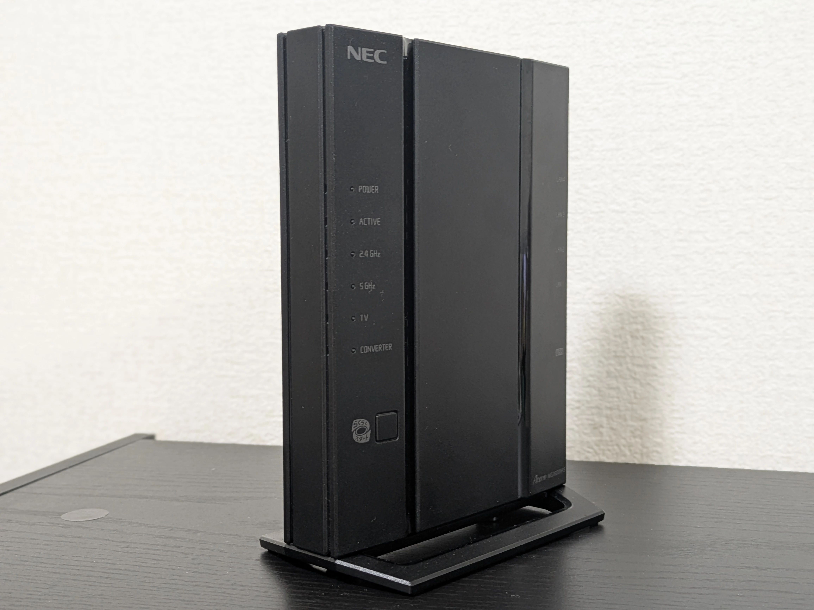
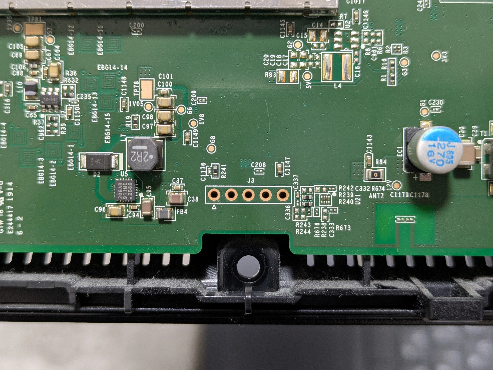

NECのAterm WG2600HP3にOpenWrtをインストールする方法について説明します。

## ハードウェア情報



| メーカー           | NEC                           |
| ------------------ | ----------------------------- |
| モデル             | Aterm WG2600HP3               |
| CPU                | Qualcomm Atheros IPQ8062 1GHz |
| フラッシュ         | 32MB                          |
| メモリ             | 512MB                         |
| イーサネットポート | 1Gbps×5                      |
| 無線LAN            | 2.4GHz: b/g/n, 5GHz: a/n/ac   |

## イメージのダウンロード

今回はOpenWrt 24.10.0をインストールします。[OpenWrtの公式ダウンロードページ](https://downloads.openwrt.org/releases/24.10.0/targets/ipq806x/generic/)から、initramfsイメージとsysupgradeイメージをダウンロードしましょう。

- nec_wg2600hp3-initramfs-uImage  
  initramfsイメージ。
- nec_wg2600hp3-squashfs-sysupgrade.bin  
  sysupgradeイメージ。

## TFTPサーバーのセットアップ

initramfsイメージの書き込みはTFTP経由で行われるため、TFTPサーバーをセットアップする必要があります。

今回はWindowsがインストールされたPCと、Windows向けのTFTPサーバーソフトウェアであるTftpd64を使用して、TFTPサーバーを構築します。

まずは、TFTPサーバーとなるPCのIPアドレスを`192.168.1.2/24`に設定しましょう。

そして、TFTPで公開する適当なディレクトリを作成し、そこにinitramfsイメージを配置します。

最後にTftpd64でTFTPサーバーを立ち上げてinitramfsイメージを公開します。Tftpd64の詳細なセットアップ方法は以下を参考にしてください。

[WindowsでTftpd64を使用してTFTPサーバーを立てる](/blog/setup-tftp-server-on-windows-using-tftpd64)

これでTFTPサーバーのセットアップは完了です。

## シリアルコンソールに接続する

Aterm WG2600HP3からUARTを引き出してシリアルコンソールに接続します。



J3がUARTの端子です。左端からVCC(3.3V)、2番目がGND、4番目がTX、5番目がRXです。USB-TTLシリアル変換ケーブル等を用いてPCと接続しましょう。

| 項目           | 設定      |
| -------------- | --------- |
| ボーレート     | 115200bps |
| データビット   | 8bit      |
| パリティビット | none      |
| ストップビット | 1bit      |
| フロー制御     | none      |

Aterm WG2600HP3の電源を入れ、u-bootの出力が出たところでEscキーを押下すると、コンソールのログイン画面が表示されます。パスワードに`chiron`と入力してログインしましょう。

これで、シリアルコンソールの接続は完了です。

## initramfsイメージのインストール

TFTPサーバーとAterm WG2600HP3をLANケーブルで接続しましょう。Aterm WG2600HP3のLANポートはLAN1からLAN4のどれでも構いません。

接続後、シリアルで以下のコマンドを実行して、initramfsイメージをインストールします。

```
boot> setenv bootcmd "nboot 0x44000000 1 0x860000;bootm"
boot> saveenv
Saving Environment to NAND...
Erasing Nand...
Erasing at 0x2a0000 -- 100% complete.
Writing to Nand... done
boot> setenv ipaddr 192.168.1.1
boot> setenv serverip 192.168.1.2
boot> tftpboot 0x44000000 <initramfsイメージへのパス>
Using eth1 device
TFTP from server 192.168.1.2; our IP address is 192.168.1.1
Filename '<initramfsイメージ>'.
Load address: 0x44000000
Loading: #################################################################
         #################################################################
         #################################################################
         #################################################################
         #################################################################
         #################################################################
         #################################################################
         ##################################################
done
Bytes transferred = 7406686 (71045e hex)
boot> bootm
```

これによりTFTPサーバーからinitramfsイメージがインストールされ、OpenWrtが起動します。しばらく待った後Enterキーを押下しましょう。

```
BusyBox v1.36.1 (2025-02-03 23:09:37 UTC) built-in shell (ash)

  _______                     ________        __
 |       |.-----.-----.-----.|  |  |  |.----.|  |_
 |   -   ||  _  |  -__|     ||  |  |  ||   _||   _|
 |_______||   __|_____|__|__||________||__|  |____|
          |__| W I R E L E S S   F R E E D O M
 -----------------------------------------------------
 OpenWrt 24.10.0, r28427-6df0e3d02a
 -----------------------------------------------------
=== WARNING! =====================================
There is no root password defined on this device!
Use the "passwd" command to set up a new password
in order to prevent unauthorized SSH logins.
--------------------------------------------------
root@OpenWrt:~#
```

このような表示が出たらinitramfsイメージのインストールは完了です。

## メーカーファームのバックアップ

将来的にメーカーファームに戻す可能性がある場合は、sysupgradeイメージを書き込む前にバックアップを取りましょう。

まずは、OpenWrtでフラッシュの中身を確認をします。

```
root@OpenWrt:~# cat /proc/mtd
dev:    size   erasesize  name
mtd0: 00020000 00010000 "SBL1"
mtd1: 00020000 00010000 "MIBIB"
mtd2: 00040000 00010000 "SBL2"
mtd3: 00080000 00010000 "SBL3"
mtd4: 00010000 00010000 "DDRCONFIG"
mtd5: 00010000 00010000 "SSD"
mtd6: 00080000 00010000 "TZ"
mtd7: 00080000 00010000 "RPM"
mtd8: 00080000 00010000 "APPSBL"
mtd9: 00010000 00010000 "APPSBLENV"
mtd10: 00030000 00010000 "PRODUCTDATA"
mtd11: 00040000 00010000 "ART"
mtd12: 00040000 00010000 "TP"
mtd13: 00500000 00010000 "TINY"
mtd14: 017a0000 00010000 "firmware"
mtd15: 00200000 00010000 "kernel"
mtd16: 015a0000 00010000 "rootfs"
mtd17: 00860000 00010000 "rootfs_data"
```

firmwareパーティションにメーカーファームが配置されています。デバイスを確認してddコマンドでバックアップを取りましょう。

```
dd if=/dev/mtd14ro of=/tmp/mtd14.dd
```

バックアップを取った後は、PCでscpコマンドを使ってメーカーファームを取得します。

```
scp root@192.168.1.1:/tmp/mtd14.dd <メーカーファームの保存先>
```

これでメーカーファームのバックアップは完了です。大切に保管しましょう。

## sysupgradeイメージのインストール

scpコマンドを使用して、PCからAterm WG2600HP3にsysupgradeイメージを転送します。

```
scp <sysupgradeイメージへのパス> root@192.168.1.1:/tmp
```

転送後、Aterm WG2600HP3でsysupgradeコマンドを使用して、sysupgradeイメージを書き込みましょう。

```
sysupgrade /tmp/<sysupgradeイメージ>
```

これによりsysupgradeイメージのインストールが開始されます。インストールが完了し、再起動されるまでしばらく待ちましょう。

再起動後、OpenWrtが起動します。これでOpenWrtのインストールは完了です。

## メーカーファームに戻す

事前にメーカーファームのバックアップを取っていた場合、OpenWrtからメーカーファームに戻すことができます。ここでは、その方法について説明します。

まずは、scpコマンドを使用して、バックアップしておいたメーカーファームをPCからAterm WG2600HP3に転送します。

```
scp <メーカーファームへのパス> root@192.168.1.1:/tmp
```

転送が完了したらOpenWrtでmtdコマンドを使用して、フラッシュにメーカーファームを書き込みましょう。ファームウェアはfirmwareパーティションに書き込みます。

```
mtd write /tmp/<メーカーファーム> "firmware"
```

書き込み完了後はAterm WG2600HP3を再起動しましょう。再起動後、メーカーファームで起動されます。
