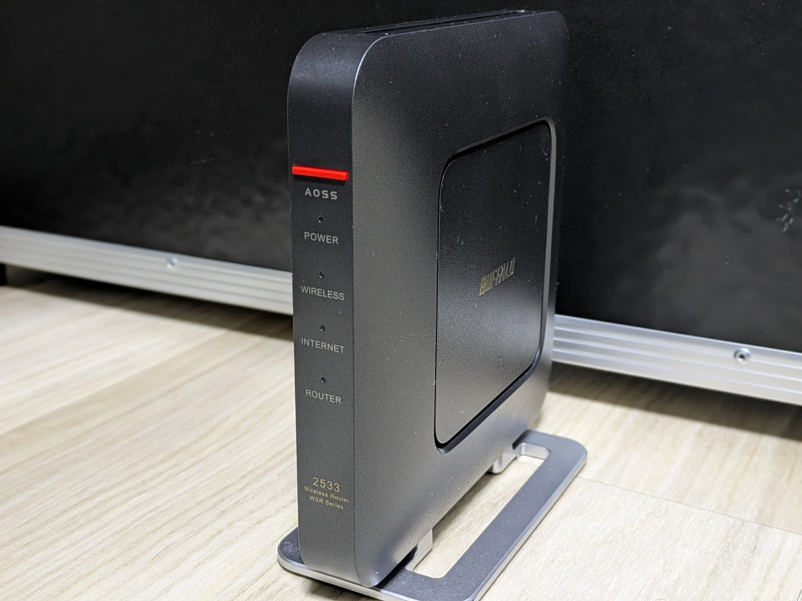

BUFFALOのWSR-2533DHPにOpenWrtをインストールする方法について説明します。

## ハードウェア情報



| メーカー           | BUFFALO                     |
| ------------------ | --------------------------- |
| 型番               | WSR-2533DHP                 |
| CPU                | Media Tek MT7621A 880MHz    |
| フラッシュ         | 16MB                        |
| メモリ             | 128MB                       |
| イーサネットポート | 1Gbps×5                    |
| 無線LAN            | 2.4GHz: b/g/n, 5GHz: a/n/ac |

## イメージのダウンロード

今回はOpenWrt 24.10.00をインストールします。[OpenWrtの公式ダウンロードページ](https://downloads.openwrt.org/releases/24.10.0/targets/ramips/mt7621/)から、initramfsイメージとsysupgradeイメージをダウンロードしましょう。

- buffalo_wsr-2533dhpl-initramfs-kernel.bin  
  initramfsイメージ。
- buffalo_wsr-2533dhpl-squashfs-sysupgrade.bin  
  sysupgradeイメージ。

wsr-2533dhplと書いてありますが、WSR-2533DHPでも問題なくインストールできます。

## TFTPサーバーのセットアップ

initramfsイメージの書き込みはTFTP経由で行われるため、TFTPサーバーをセットアップする必要があります。

今回はWindowsがインストールされたPCと、Windows向けのTFTPサーバーソフトウェアであるTftpd64を使用して、TFTPサーバーを構築します。

まずは、TFTPサーバーとなるPCのIPアドレスを`192.168.11.2/24`に設定しましょう。

そして、TFTPで公開する適当なディレクトリを作成し、そこにinitramfsイメージを`linux.trx-recovery`というファイル名にリネームして配置します。

最後にTftpd64でTFTPサーバーを立ち上げてinitramfsイメージを公開します。Tftpd64の詳細なセットアップ方法は以下を参考にしてください。

[WindowsでTftpd64を使用してTFTPサーバーを立てる](/blog/setup-tftp-server-on-windows-using-tftpd64)

これでTFTPサーバーのセットアップは完了です。

## initramfsイメージのインストール

TFTPサーバーとWSR-2533DHPをLANケーブルで接続しましょう。WSR-2533DHPのLANポートはLAN1からLAN4のどれでも構いません。

この状態で、WSR-2533DHPのAOSSボタンを押しながら電源を入れてください。AOSSボタンを押し続けて数秒待つと、WSR-2533DHPがTFTPサーバーからinitramfsイメージを取得しに行きます。


転送が完了したことを確認できたら、TFTPサーバーは閉じてPCのIPアドレスを自動取得に戻しましょう。

ここまで出来たら、IPアドレス`192.168.1.1`にSSHで接続します。ユーザー名は`root`、パスワードは設定されていません。


このような表示が出たらinitramfsイメージのインストールは完了です。

## メーカーファームのバックアップ

将来的にメーカーファームに戻す可能性がある場合は、sysupgradeイメージを書き込む前にバックアップを取りましょう。

まずは、OpenWrtでフラッシュの中身を確認をします。

```
root@OpenWrt:~# cat /proc/mtd
dev:    size   erasesize  name
mtd0: 00030000 00010000 "u-boot"
mtd1: 00010000 00010000 "u-boot-env"
mtd2: 00010000 00010000 "factory"
mtd3: 007c0000 00010000 "firmware"
mtd4: 00308a14 00010000 "linux"
mtd5: 004b75d0 00010000 "rootfs"
mtd6: 00070000 00010000 "rootfs_data"
mtd7: 007c0000 00010000 "Kernel2"
mtd8: 00010000 00010000 "glbcfg"
mtd9: 00020000 00010000 "board_data"
```

firmwareパーティションにメーカーファームが配置されています。デバイスを確認してddコマンドでバックアップを取りましょう。

```
dd if=/dev/mtd3ro of=/tmp/mtd3.dd
```

バックアップを取った後は、PCでscpコマンドを使ってメーカーファームを取得します。

```
scp root@192.168.1.1:/tmp/mtd3.dd <メーカーファームの保存先>
```

これでメーカーファームのバックアップは完了です。大切に保管しましょう。

## sysupgradeイメージのインストール

scpコマンドを使用して、PCからWSR-2533DHPにsysupgradeイメージを転送します。

```
scp <sysupgradeイメージへのパス> root@192.168.1.1:/tmp
```

転送後、WSR-2533DHPでsysupgradeコマンドを使用して、sysupgradeイメージを書き込みましょう。

```
sysupgrade /tmp/<sysupgradeイメージ>
```

これによりsysupgradeイメージのインストールが開始されます。インストールが完了し、再起動されるまでしばらく待ちましょう。

再起動後、確認のためにブラウザで`192.168.1.1`へアクセスしてみます。ログイン画面が表示されたら、ssh接続と同様にユーザー名は`root`、パスワードは空でログインできます。


問題なくログインできました。これでOpenWrtのインストールは完了です。

## メーカーファームに戻す

事前にメーカーファームのバックアップを取っていた場合、OpenWrtからメーカーファームに戻すことができます。ここでは、その方法について説明します。

まずは、scpコマンドを使用して、バックアップしておいたメーカーファームをPCからWSR-2533DHPに転送します。

```
scp <メーカーファームへのパス> root@192.168.1.1:/tmp
```

転送が完了したらOpenWrtでmtdコマンドを使用して、フラッシュにメーカーファームを書き込みましょう。

```
mtd write /tmp/<メーカーファーム> "firmware"
```

書き込み完了後はrebootコマンドを実行して再起動しましょう。再起動後、メーカーファームで起動されます。
