Proxmox VE(Virtual Environment)は、KVMとLXCをベースにしたオープンソースの仮想化プラットフォームで、Web UIから簡単に仮想マシンとコンテナの作成、管理が行えます。

ここでは、Proxmox VEをインストールする方法について説明します。

## はじめに

今回は、GMKtecが販売しているミニPCの[NucBox M5 Plus](https://www.gmktec.com/products/amd-ryzen-7-5825u-mini-pc-nucbox-m5-plus)に、Proxmox VEをインストールします。



NucBox M5 Plusのスペックは以下の通りです。

| メーカー         | GMKtec                                          |
| ---------------- | ----------------------------------------------- |
| モデル           | NucBox M5 Plus                                  |
| CPU              | AMD Ryzen 7 5825U (8コア16スレッド 最大4.50GHz) |
| メモリ           | 16GB (8GB×2)                                   |
| ストレージ       | SSD 512GB                                       |
| グラフィック     | AMD Radeon Graphics (CPU内蔵)                   |
| ネットワーク     | LAN (2.5Gb)×2、Wi-Fi 6E、Bluetooth 5.2         |
| インターフェース | USB Type-C (映像出力対応)×1、USB3.2 Gen1×2、USB2.0×2、HDMI×1、DisplayPort×1、オーディオ端子 (3.5mm 4極) |
| 拡張スロット     | M.2スロット×3 (ストレージ用×2、Wi-Fi用×1)    |

## Proxmox VEのダウンロード

[Proxmox VEのダウンロードページ](https://www.proxmox.com/en/downloads/proxmox-virtual-environment/iso)から、ISOイメージをダウンロードします。今回はProxmox VE 8.3をダウンロードしました。

## インストール用USBメモリの作成

先ほどダウンロードしたISOイメージを、USBメモリに書き込みます。Win32 Disk Imagerなどのイメージ書き込みソフトを使用してUSBメモリへ書き込みましょう。

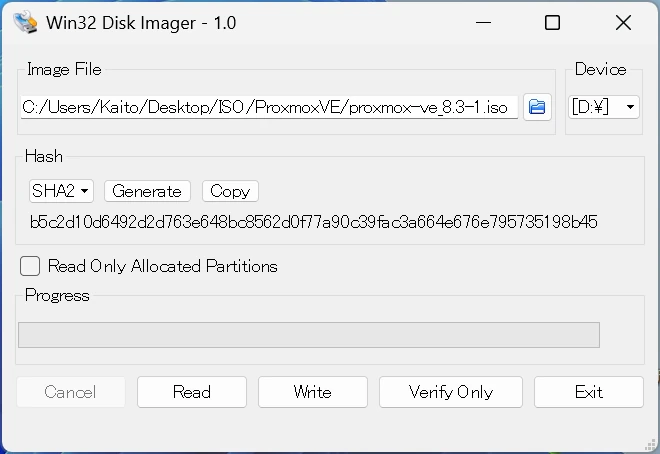

Win32 Disk Imagerを使用した書き込み方法については、[Win32 Disk Imagerのインストールと使い方](/blog/install-win32-disk-imager)で詳しく説明しています。そちらを参考にしてください。

## Proxmox VEのインストール

Proxmox VEをインストールしたいPCにUSBメモリを接続し、PCを起動してUSBメモリからブートさせましょう。起動するとProxmox VEのインストール画面が表示されます。

### インストールタイプの選択

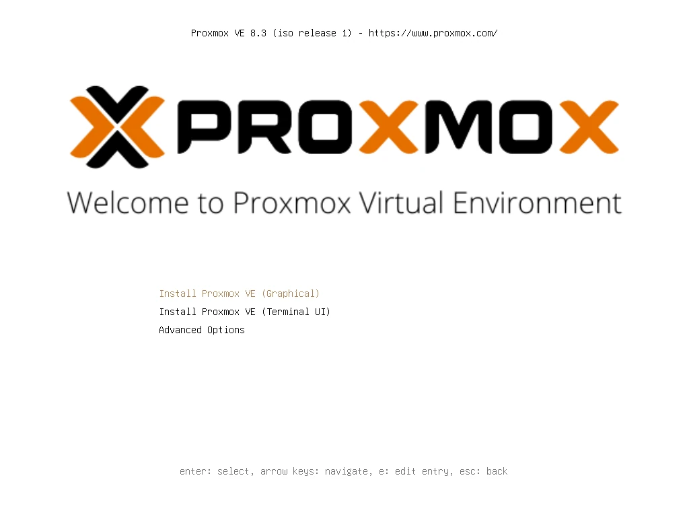

インストールタイプが表示されます。「Install Proxmox VE (Graphical)」を選択してGUIでインストールを進めます。

### 利用許諾の確認

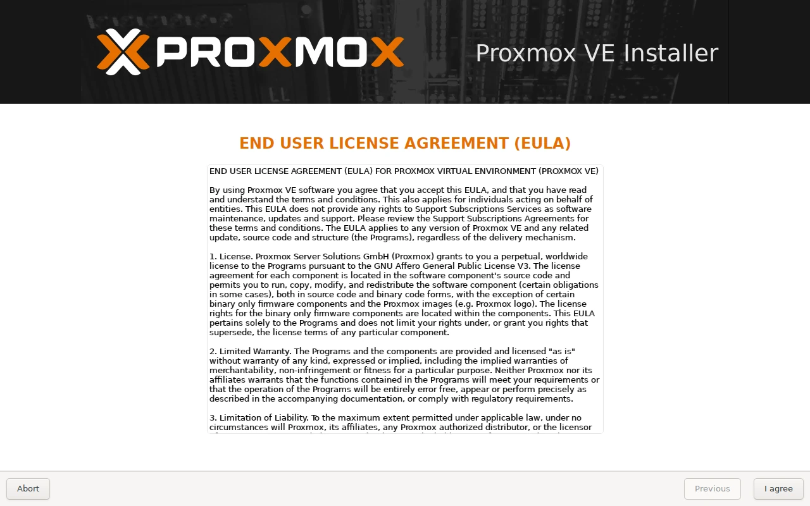

Proxmox VEの利用許諾が表示されます。特に問題がなければ「I agree」を押して次へ進めましょう。

### インストール先の設定

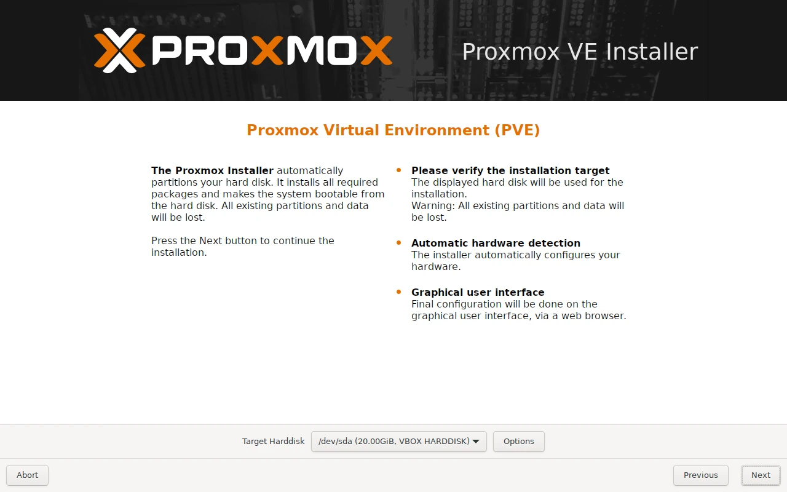

Proxmox VEのインストール先を選択しましょう。「Options」からはファイルシステムなどの詳細な設定ができます。

Proxmox VEのインストール先が選択できたら「Next」を押して次へ進めましょう。

### 国・タイムゾーン・キーボード配列の設定

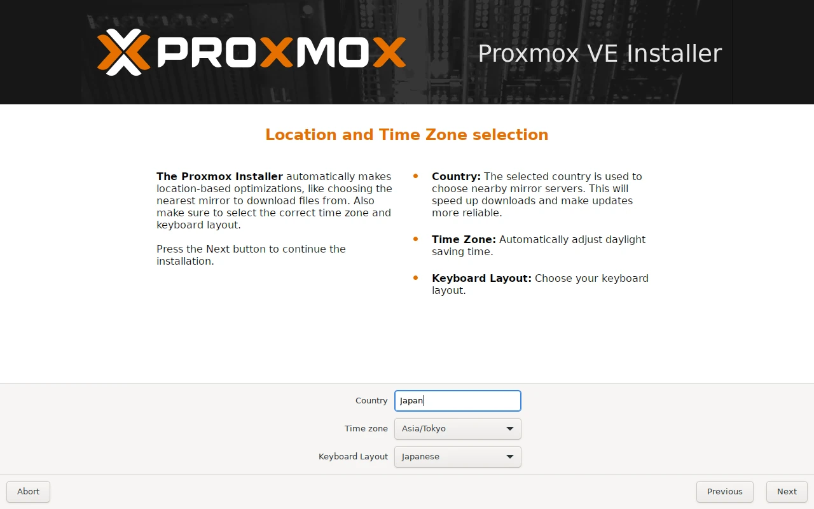

国、タイムゾーン、キーボード配列を設定します。この時点でインターネットに接続していれば各項目は自動で入力されます。

設定できたら「Next」を押して次へ進めましょう。

### 管理者のパスワード・メールアドレスの設定

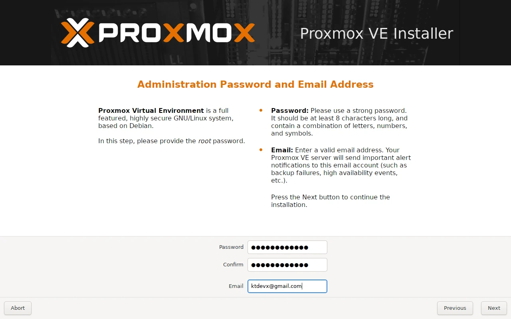

管理者ユーザー(`root`)のパスワードと、メールアドレスを設定します。確認のためパスワードは2回入力します。

設定できたら「Next」を押して次へ進みましょう。

### ネットワークの設定

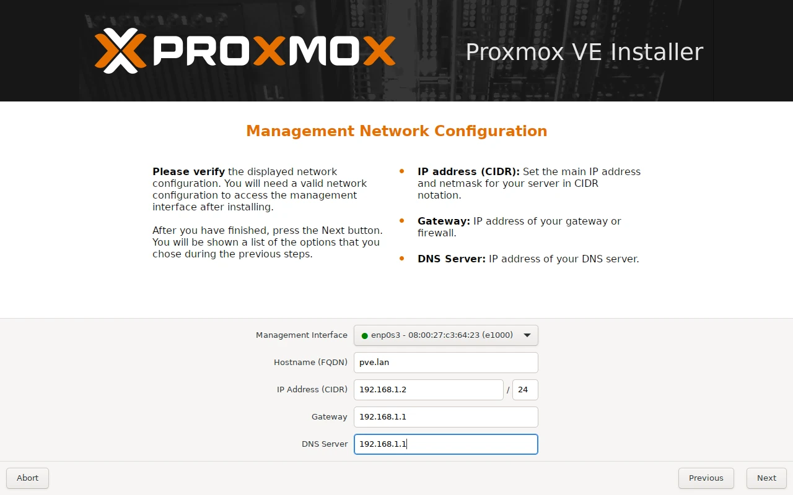

使用するネットワークインターフェース、ホスト名、IPアドレス等の設定を行います。

設定できたら「Next」を押して次へ進めましょう。

### 設定項目の確認

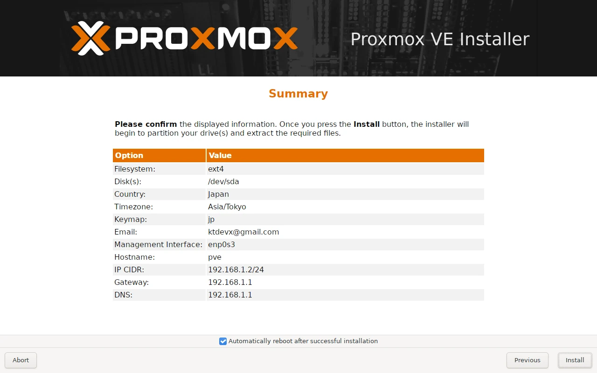

いままで設定した項目が表示されます。確認して問題がなければ「Install」を押してインストールを開始しましょう。

### インストール

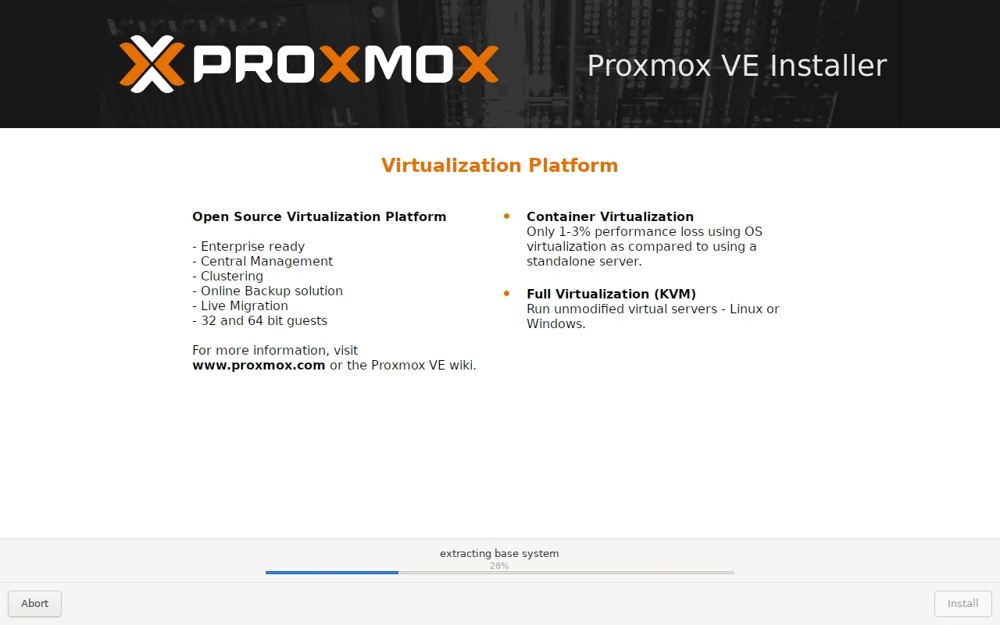

インストールが完了するまでしばらく待ちます。インストールが完了したら、USBメモリを抜いてPCを再起動しましょう。特に問題がなければ、シェルのログイン画面が表示されます。

### Proxmox VEの管理画面にアクセス

最後に、Proxmox VEの管理画面にアクセスしてみましょう。Webブラウザから`https://<設定したIPアドレス>:8006`にアクセスします。

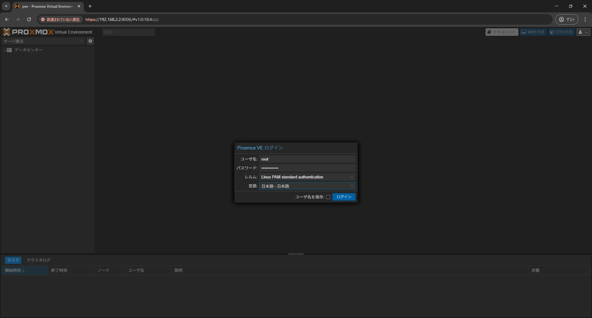

アクセスするとログイン画面が表示されます。ユーザー名は`root`で、パスワードはインストール時に設定したパスワードを入力してログインしましょう。

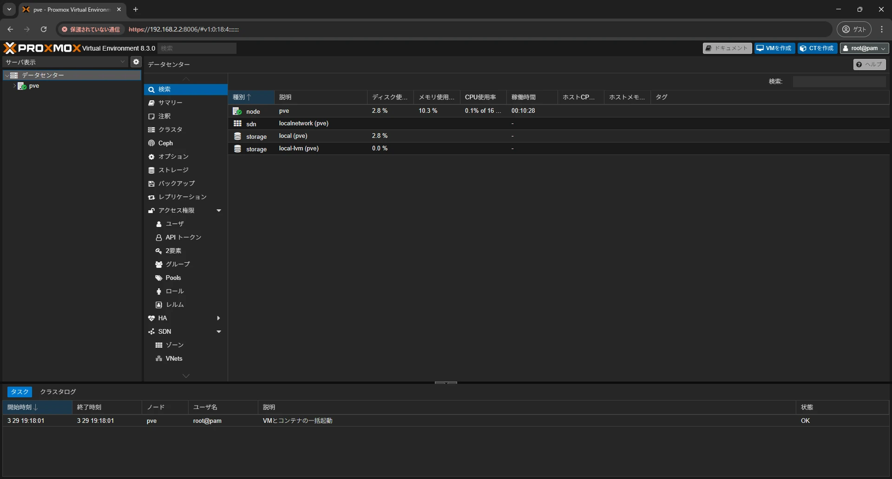

Proxmox VEの管理画面にログインできました。これでProxmox VEのインストールは完了です。
