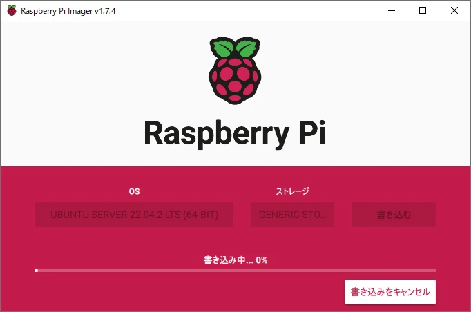

Raspberry Piは、Raspberry Pi OSの他にUbuntuを起動することもできます。

ここでは、Raspberry PiにUbuntuをインストールする方法について解説します。

## Raspberry Pi Imagerをインストール

microSDにUbuntuを書き込むため、Raspberry Pi Imagerというツールをインストールします。

[公式サイト](https://www.raspberrypi.com/software/)からツールをダウンロードし、PCにインストールしてください。

## UbuntuをmicroSDに書き込む

UbuntuをmicroSDに書き込みます。microSDをPCにセットし、Raspberry Pi Imagerを起動してください。


「OSを選ぶ」、「Other general-purpose OS」、「Ubuntu」の順に選択すると、インストール可能なUbuntuの一覧が表示されます。


任意のOSを選択してください。

OS選択後は「ストレージを選ぶ」から、Ubuntuを書き込みたいmicroSDを選択します。


OSとストレージの選択に問題がなければ、「書き込む」を選択して書き込みを開始してください。



しばらく待つと書き込みが完了します。

## Ubuntuを起動

Raspberry Piに、Ubuntuが書き込まれたmicroSDを差し込み、電源を入れて起動してください。

ログインを要求されるため、ユーザー名とパスワードに`ubuntu`と入力します。

```
Ubuntu 22.04.2 LTS ubuntu tty1

ubuntu login: ubuntu
Password:
```

初回ログイン時は、パスワードを変更するように要求されます。任意のパスワードを入力して再設定してください。

```
You are required to change your password immediately (administrator enforced).
Changing password for ubuntu.
Current password:
New password:
Retype new password:
```

これにより、Raspberry PiでUbuntuが使用可能になります。
