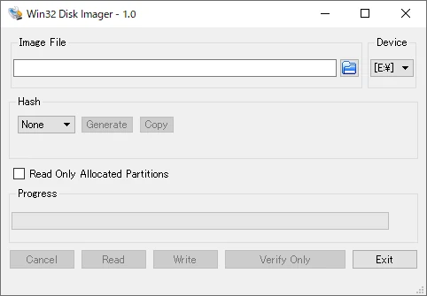
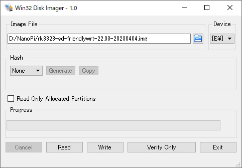
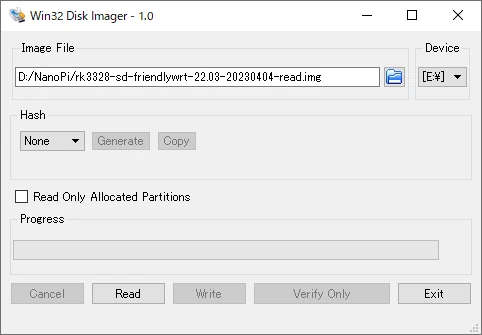
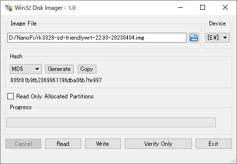

Win32 Disk Imagerは、Windows上で動作するディスクイメージ書き込みソフトです。

ここでは、Win32 Disk Imagerのインストールと使い方について、解説します。

## Win32 Disk Imagerとは

Win32 Disk Imagerは、SDカードやUSBメモリにディスクイメージを書き込むためのWindowsツールです。IMG形式のディスクイメージに対応しています。

このツールを使用すると、ディスクイメージをリムーバブルディスクに書き込んだり、リムーバブルディスクの内容をイメージファイルとして保存することができます。

このツールは、オープンソースで開発されており、無料でダウンロードして使用することができます。

## Win32 Disk Imagerのインストール

[公式サイト](https://sourceforge.net/projects/win32diskimager/)からWin32 Disk Imagerのインストーラーをダウンロードし、ダウンロードが完了したらインストーラーを起動してツールをインストールします。

インストール時に、保存先やショートカットの作成可否について問われますが、特に指定がなければデフォルトの設定で進めて問題ありません。

## ディスクイメージの書き込み

SDカード・USBメモリにディスクイメージを書き込みます。

Image Fileで書き込みたいイメージファイルを指定し、Deviceから書き込み先のドライブを選択します。Writeをクリックすると書き込みが開始されます。

## ディスクイメージの読み出し

SDカード・USBメモリからディスクイメージを読み出します。

Image Fileにイメージファイルの保存先を指定し、Deviceから読み出したいドライブを選択します。Readをクリックすると読み出しが開始されます。

## ハッシュ値の計算

イメージファイルのハッシュ値を計算します。これにより、イメージファイルの提供元で公開されているハッシュ値と比較し、破損や改ざんを検出することができます。

Image Fileにハッシュ値を計算したいイメージファイルを指定し、Hashからアルゴリズムを選択します。Generateをクリックするとハッシュ値が表示されます。

ハッシュ値計算のアルゴリズムは、MD5・SHA1・SHA256から選択できます。
