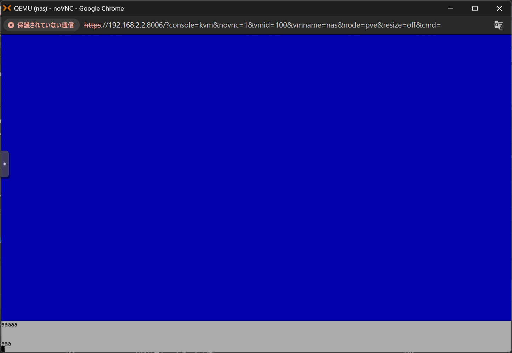

OpenMediaVaultのインストール中、DHCPv6の設定でスタックする現象に遭遇しました。

ここでは、その現象と対処法について説明します。

## 現象

OpenMediaVaultのインストールをしていたところ、DHCPv6の自動設定が動作したところでインストールがスタックし、ブルースクリーンのまま停止しました。

画像下の方を見るとわかりますが、完全に止まっているわけではなく、入力は受け付けている状態です。

## 解析結果

私の環境では、IPv6アドレスはISPからSLAAC方式で割り当てられており、ルーター側でRAとDHCPv6、NDPプロキシを全てリレーする設定にしておりました。

SLAAC方式では、IPv6アドレスのプレフィックスがRAで通知されます。そして、DNSサーバーのアドレスについては、DHCPv6のInformation-requestか、RDNSSのいずれかで取得することになります。

ルーターのパケットを解析すると、私の環境ではDNSサーバーのアドレスはInformation-requestにより取得されていました。

ルーターでDHCPv6をリレーする場合、クライアントから送られてきたInformation-requestを、ルーターがDHCPv6サーバーに向けてRelay-forwordで転送することになります。

DHCPv6リレー時のパケットを解析したところ、DHCPv6サーバーがRelay-forwordに対応していなかったようで、結果的にクライアントにInformation-requestの応答が返らない状態となっていました。

これにより、OpenMediaVaultのインストールがスタックしてしまっていたようです。

## 対処法

### 一時的にIPv6を無効化する

まずはネットワーク設定を見直すことを推奨しますが、IPv6環境下でよくないことが起きていることは明白なので、ルーターの設定で一時的にIPv6を無効化してみるのも一つの手です。

試しにルーターのIPv6設定を全て無効化したところ、OpenMediaVaultのインストールがスタックせずに進むことを確認しました。

IPv6環境下でなければ良いので、インストーラーがIPv6の設定をしている時だけLANケーブルを抜く、というのも効果があります。

とりあえずインストールしたい、そもそもIPv6は必要ない、という場合はこの方法で良いかと思います。

### ネットワークのIPv6設定を見直す

私の環境では、DHCPv6のInformation-requestをルーターからDHCPv6サーバーへ転送するのは辞め、ルーター側で応答を返させるように設定を変更しました。

これにより、OpenMediaVaultのインストールにてスタックしないようになりました。

クライアントからルーターにかけて、IPv6のパケットを監視してどこでなにが起きているか、見直してみましょう。
