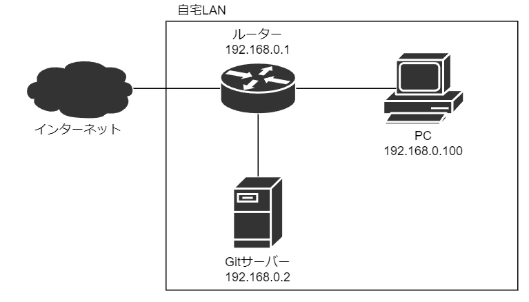

自宅にGitサーバーを構築することは、自分のソースコードを公開したくない場合や、サーバーを自分でカスタマイズしたい場合に非常に有用です。

安価に入手でき、インターネット上でも情報が豊富なRaspberry Piを使って、Gitサーバーを構築してみましょう。

## ネットワーク構成

ネットワーク構成は以下の通りです。



Raspberry PiでGitサーバーを構築し、同じネットワーク内に存在するPCからGitサーバーにアクセスできるようにします。

## Raspberry Piの事前準備

### OSのインストール

最初に、Raspberry PiにOSをインストールする必要があります。サーバー用途の場合はGUIは不要なため、今回はRaspberry Pi OS Liteをインストールします。

Raspberry Pi OS LiteはRaspberry Pi用のOSで、公式サイトからダウンロードすることができます。OSをインストールする方法については、Raspberry Piの[公式サイト](https://www.raspberrypi.com/)に詳しい手順が記載されています。

### 固定IPアドレスの設定

Raspberry Piに常に同じIPアドレスでアクセスできるようにするために、固定IPアドレスを割り当てます。

IPアドレスを変更するには、以下のコマンドを実行します。

```
sudo vi /etc/dhcpcd.conf
```

テキストエディターが起動するため、以下の内容をファイルに追記します。

```
interface eth0
static ip_address=192.168.0.2/24
static routers=192.168.0.1
static domain_name_servers=192.168.0.1
```

この例では、IPアドレスが`192.168.0.2`、サブネットマスクが`255.255.255.0`、デフォルトゲートウェイとDNSサーバーが`192.168.0.1`であることを指定しています。

ファイルを保存し、以下のコマンドでRaspberry Piを再起動します。

```
sudo reboot
```

これにより、IPアドレスが固定化されます。

### SSHサーバーの有効化

Raspberry PiにSSHで接続できるようにするため、SSH接続を有効化します。手順については、以下の記事で詳しく説明しています。

[Raspberry Pi OSでSSH接続を有効化する](/blog/enable-ssh-on-raspberry-pi-os)

## Gitのインストール

サーバーにGitをインストールするために、以下のコマンドを実行します。

```
sudo apt update
sudo apt install git
```

これにより、サーバーにGitがインストールされます。

## Gitユーザーの追加とディレクトリの作成

Git操作用に、`git`という名前のユーザーをサーバー上に作成します。ユーザーの作成には以下のコマンドを実行します。

```
sudo adduser git
```

パスワードを聞かれるため、任意のパスワードを入力してEnterキーを押します。再度パスワードを入力するよう求められるため、同じパスワードを入力してEnterキーを押します。これにより、gitユーザーが作成されます。

次に、Gitリポジトリを格納するディレクトリを作成します。作成には以下のコマンドを実行します。

```
sudo mkdir /opt/git
sudo chown git:git /opt/git
```

このコマンドは、`/opt`ディレクトリ配下に`git`という名前のディレクトリを作成し、その所有者を`git`ユーザーに変更するものです。こうすることで、`git`ユーザーが`/opt/git`配下に作成されるGitリポジトリを読み書きできるようになります。

以降、サーバー上での操作は`git`ユーザーで行います。以下のコマンドを実行し、ユーザを切り替えます。

```
su git
```

## SSH公開鍵の登録

SSH鍵を生成することで、Gitサーバーとの通信をセキュアに行うことができます。GitサーバーにSSHでアクセスするために、公開鍵の登録を行います。

PCで以下のコマンドを実行し、SSH鍵を生成します。

```
ssh-keygen
```

Enterキーを押すと、デフォルトの設定で鍵が生成されます。デフォルト設定の場合、`.ssh`ディレクトリに`id_rsa`という名前の秘密鍵と、`id_rsa.pub`という名前の公開鍵が生成されます。

SSHでアクセスするためには、サーバーに公開鍵を登録する必要があります。生成した公開鍵は、FTPやSFTPを利用してサーバーに転送しましょう。

公開鍵の転送後は、`.ssh`ディレクトリ配下に`authorized_keys`という名前のファイルを作成し、そこに公開鍵を登録します。サーバー上で以下のコマンドを実行し、`authorized_keys`を作成します。

```
cd
mkdir .ssh && chmod 700 .ssh
touch .ssh/authorized_keys && chmod 600 .ssh/authorized_keys
```

空の`authorized_keys`が作成されるため、先ほど作成した公開鍵をこのファイルに追加します。

```
cat <公開鍵の保存先ディレクトリ>/id_rsa.pub >> ~/.ssh/authorized_keys
```

これにより、`authorized_keys`に公開鍵が追加されます。

## Gitリポジトリの作成

Gitサーバーにリポジトリを作成するため、以下のコマンドを実行します。

```
mkdir /opt/git/project.git
cd /opt/git/project.git
git init --bare
```

この例では、`project.git`という名前でGitリポジトリを作成しています。

`git init`コマンドに`--bare`オプションを指定して実行することで、作業ディレクトリを持たない空のリポジトリが作成されます。これを、ベアリポジトリといいます。

ベアリポジトリのディレクトリ名の末尾には、`.git`を付けるという慣例があります。

## Gitリポジトリのクローン

リポジトリをクローンするためには、以下のコマンドを実行します。

```
git clone git@192.168.0.2:/opt/git/project.git
```

以上で、Raspberry Piを使用して自宅にGitサーバーを構築することができます。
