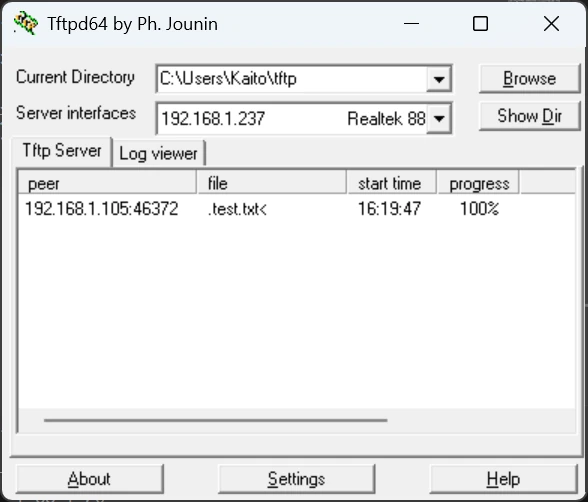

Tftpd64は、Windows向けのTFTP、SNTP、SYSLOG、DHCP、DNSサーバーのソフトウェアです。

ここでは、Tftpd64を使用してWindows上でTFTPサーバーを立てる方法について説明します。

## Tftpd64のインストール

[Tftpd64の公式サイト](https://pjo2.github.io/tftpd64/)のダウンロードページにて、`Tftpd64-<バージョン>-setup.exe`というファイル名でインストーラーが配布されています。インストーラーをダウンロードして実行しましょう。

ライセンスが表示されます。内容を確認し、「I Agree」を押して次へ進めましょう。

インストール条件を設定できます。設定後、「Next」を押して次へ進めましょう。

Tftpd64をインストールする場所を設定します。設定後、「Install」を押すことでインストールが開始されます。

画面上に「Completed!」と表示されればインストール完了です。「Close」を押してインストーラーを終了します。

## Tftpd64の使い方

インストールされた「tftpd64.exe」を実行してTftpd64を起動します。

Tftpd64を起動したら、最初に「Settings」を押して設定画面を開きましょう。

設定画面の「GLOBAL」タブでは、Tftpd64全体に関わる設定を変更できます。今回はTFTPサーバーしか利用しないため、「TFTP Server」だけにチェックを付けましょう。

設定画面の「TFTP」タブでは、TFTPに関わる設定を変更出来ます。TFTPサーバーで公開するベースディレクトリを「Base Directory」で設定しましょう。

Tftpd64はデフォルトの状態では、全てのネットワークインターフェースでTFTPクライアントからの通信を受け付けます。「Bind TFTP to this address」にチェックを入れ、IPアドレスを指定することで、サーバーを公開するIPアドレスを指定することができます。

設定したら「OK」を押して設定を反映させてください。

確認のダイアログが表示されます。「OK」を押すことでTftpd64が再起動されます。以上でTFTPのセットアップは完了です。

フォルダに適当なファイルを置いて、実際にTFTPクライアントから取得してみましょう。

TFTPクライアントからアクセス出来ていることを確認できました。

アクセスできない場合はIPアドレスやポートの設定、セキュリティソフトでブロックされていないかを見直しましょう。
