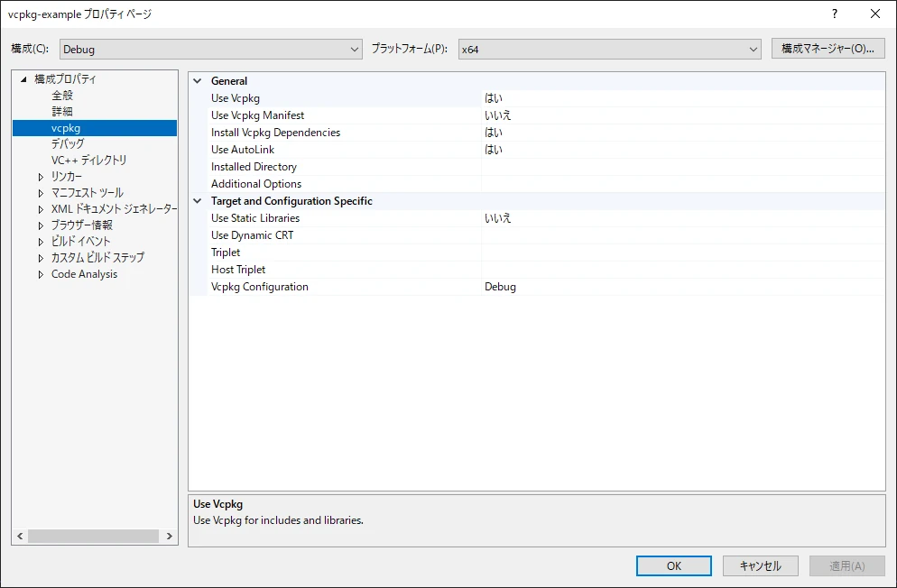

vcpkgとは、Microsoftが提供するC/C++ライブラリ向けのパッケージ管理システムです。

ここでは、vcpkgを使用してC/C++ライブラリを導入する方法について解説します。

## vcpkgを導入するメリット

通常、WindowsでOSSのライブラリを利用する場合、ビルドや依存関係の解決は自分で行わなければなりません。ライブラリの構成が複雑だと、導入するだけでもかなりの時間を要してしまいます。

vcpkgを利用すると、これらの厄介な作業はツールが自動で行ってくれるため、ライブラリを簡単にインストールすることができます。開発者はプログラミングに集中できるため、開発効率の向上に繋がります。

## vcpkgのインストール

vcpkgをインストールするには、ソースコード一式をダウンロードして実行ファイルを生成する必要があります。難しそうに感じますが、インストールは2ステップで完了するためとても簡単です。

### ソースコード一式をダウンロード

vcpkgのソースコードはGitHubで公開されています。Gitを使用し、GitHubからvcpkgのリポジトリをクローンします。

```
git clone https://github.com/microsoft/vcpkg.git
```

ローカルリポジトリはクローンを実行したディレクトリに作成されます。事前にvcpkgをインストールしたいディレクトリへ移動しましょう。Cドライブ直下などの短いパスでクローンすることを推奨します。

### 実行ファイルを生成

ローカルリポジトリの中に、`bootstrap-vcpkg.bat`という名前のバッチファイルが格納されています。実行ファイルの生成はバッチファイルが自動で行なってくれます。

```
cd vcpkg
bootstrap-vcpkg.bat
```

`vcpkg.exe`という名前の実行ファイルがローカルリポジトリ内に生成されていれば、vcpkgのインストールは完了です。

実行ファイルへのパスを環境変数に設定しておくと、任意のディレクトリから呼び出せるため便利です。

## vcpkgの基本操作

### 利用可能なライブラリを検索

`vcpkg search`コマンドで利用可能なライブラリを検索します。

```
vcpkg search [<パッケージ名>]
```

パッケージ名を指定することで一致するライブラリのみを表示することができます。指定しない場合は利用可能なライブラリが全て表示されます。

利用可能なライブラリは、[パッケージ一覧](https://vcpkg.io/en/packages.html)から検索することも可能です。

### ライブラリのインストール

`vcpkg install`コマンドでライブラリをインストールします。

```
vcpkg install <パッケージ名>
```

### インストールしたライブラリを表示

インストールしたライブラリは、`vcpkg list`コマンドで表示できます。

```
vcpkg list [<パッケージ名>]
```

パッケージ名を指定することで一致するライブラリのみを表示することができます。指定しない場合はインストールしたライブラリが全て表示されます。

### ライブラリのアンインストール

`vcpkg remove`コマンドでライブラリのアンインストールが行えます。

```
vcpkg remove <パッケージ名>
```

## ターゲット環境の指定

vcpkgはクロスコンパイルの仕組みを提供しています。

tripletオプションを利用することで、任意の環境で動作するライブラリのインストールや、アンインストールが行えます。

tripletとはターゲット環境を表す文字列です。CPUやOS、ライブラリのリンク方法などを指定することができます。

```
vcpkg install <パッケージ名> --triplet=<ターゲット環境>
vcpkg install <パッケージ名>:<ターゲット環境>
```

対応しているターゲット環境は、`vcpkg help triplet`で確認できます。

## インストールしたライブラリの利用

### Visual Studioから利用

`vcpkg integrate`コマンドで、vcpkgでインストールしたライブラリをVisual Studioから利用できます。

```
vcpkg integrate install
```

これによって、インクルードディレクトリやライブラリディレクトリ、ライブラリが自動でVisual Studioに追加されます。

Visual Studioでプロジェクトを開き、プロパティからtripletの設定をすることでターゲット環境を変更できます。



### CMakeから利用

CMakeで`CMAKE_TOOLCHAIN_FILE`変数に`vcpkg.cmake`へのパスを設定することで、vcpkgでインストールしたライブラリをCMakeから利用できます。

```
cmake [<プロジェクトへのパス>] -D CMAKE_TOOLCHAIN_FILE=<vcpkgへのパス>/scripts/buildsystems/vcpkg.cmake
```

これによって、CMakeからライブラリを検索できるようになります。

ターゲット環境は`VCPKG_TARGET_TRIPLET`変数を設定することで変更できます。

```
cmake [<プロジェクトへのパス>] -D VCPKG_TARGET_TRIPLET=<ターゲット環境> -D CMAKE_TOOLCHAIN_FILE=<vcpkg.cmakeへのパス>
```

### その他の開発環境から利用

インストールしたライブラリは`vcpkg/installed/<ターゲット環境>`ディレクトリに格納されています。

利用する側でパスを適切に指定することでvcpkgでインストールしたライブラリを利用できます。

## 外部リンク

* [vcpkg - Open source C/C++ dependency manager from Microsoft](https://vcpkg.io/en/)
* [GitHub - microsoft/vcpkg: C++ Library Manager for Windows, Linux, and MacOS](https://github.com/microsoft/vcpkg)
